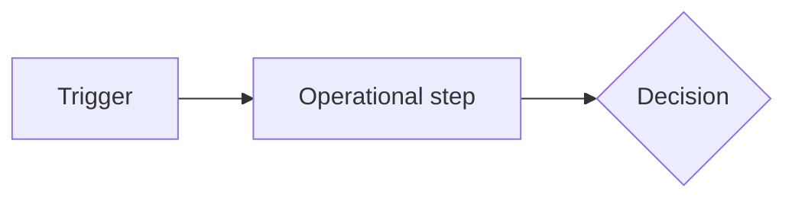

# Design - Process Mode

Use this mode for operational ownership, handoffs, controls, support paths, exception handling, and process evidence.

## Purpose

Define how people, teams, systems, and providers operate the demand in practice. Process Design owns `PR-*` requirements and controls that are not UI or code-level implementation.

## File

Write to `02-design/process-design.md`. Update `traceability.md` with `PR-*` items mapped to `BR-*`, `BD-*`, `UX-*`, and later `TC-*`.

## Minimum fact base

Use:

- Shaping operating model assessment;
- requirements;
- UI/CX journeys where process depends on user/admin state;
- current operational workflows, owners, support paths, finance/accounting/reporting/compliance needs, and exception scenarios.

## Workflow

1. Read Discovery, Requirements, and UI/CX where relevant.
2. Define as-is process only when it affects target decisions.
3. Define target process with actors, handoffs, decisions, states, exceptions, controls, and support ownership.
4. Identify process requirements and operational acceptance criteria.
5. Record open decisions and operational risks.
6. Update `traceability.md`.

## Output contract

Use this structure:

```markdown
# Process Design

Status: In progress
Owner: TBC
Last updated: YYYY-MM-DD
Source artefacts: 01-discovery/shaping.md, 02-design/requirements.md, 02-design/ui-cx-journeys.md
Blocks: none

## Process objective

## Actors and responsibilities
| Actor / team | Responsibility | Decision rights | Backup / escalation |
|---|---|---|---|

## As-is process summary

## To-be process
| PR ID | Step | Actor | Trigger | Input | Action / decision | Output | Control | Related BRs / UX |
|---|---|---|---|---|---|---|---|---|
| PR-AREA-001 |  |  |  |  |  |  |  | BR-AREA-001 |

## Process flow



## Exceptions and recovery
| PR ID | Exception | Detection | Owner | Recovery | Customer / user impact | Related tests |
|---|---|---|---|---|---|---|

## Controls, audit and reporting
| Control ID | Control | Risk addressed | Evidence | Owner | Frequency |
|---|---|---|---|---|---|

## Support model
| Scenario | First-line owner | Escalation | SLA / expectation | Tooling / evidence |
|---|---|---|---|---|

## Operational acceptance criteria
| PR ID | Criteria | Validation |
|---|---|---|

## Open questions / decisions needed

## Handoff notes
```

## Review gate

Process Design is not ready unless:

- ownership and handoffs are explicit;
- exceptions and recovery paths are covered for material scenarios;
- operational controls map to risks;
- support and escalation expectations are defined where relevant;
- process requirements trace to business requirements and customer journeys;
- implementation-dependent gaps are routed to Solution or Technical Design.
