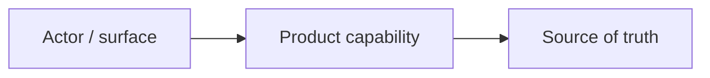

# Design - Solution Mode

Use this mode for conceptual solution architecture, source of truth, system responsibilities, data/API concepts, controls, integrations, and cross-cutting solution ownership.

## Purpose

Translate business, UX, and process design into a target solution view without dropping into code-level tasks. Solution Design owns `SD-*` decisions.

## File

Write to `02-design/solution-design.md`. Update `traceability.md` with `SD-*` decisions mapped to `BD-*`, `BR-*`, `UX-*`, `PR-*`, and later `TR-*`.

## Minimum fact base

Use:

- Shaping direction and design principles;
- requirements;
- UI/CX journeys;
- process design;
- relevant current product, codebase, data, integration, or operational evidence when it affects architecture;
- known constraints around payments, reporting, compliance, privacy, security, finance, support, or operations.

## Workflow

1. Read upstream Design artefacts.
2. Identify conceptual components, source-of-truth records, actors, surfaces, data flows, controls, and integration boundaries.
3. Classify current-to-target relationship: net-new, extends existing, changes existing, replaces legacy, or validates uncertain capability.
4. Define solution responsibilities and decision ownership.
5. Load/read and apply `$architecture-standards` when available for material boundary, source-of-truth, contract, persistence, async, auth/tenancy, operability, cost, or maintainability decisions.
6. If codebase context materially affects the solution and `$graphify` is available, use the current graph or update it before finalizing responsibilities. Record key graph signals in `quality-gates.md`.
7. Identify technical validation points.
8. Update `traceability.md` and `quality-gates.md`.

## Output contract

Use this structure:

```markdown
# Solution Design

Status: In progress
Owner: TBC
Last updated: YYYY-MM-DD
Source artefacts: 01-discovery/shaping.md, 02-design/requirements.md, 02-design/ui-cx-journeys.md, 02-design/process-design.md
Blocks: none

## Solution purpose

## Current-to-target classification
| Area | Current state | Target state | Classification | Evidence |
|---|---|---|---|---|

## End-to-end solution architecture



## Solution responsibilities
| SD ID | Capability / component | Responsibility | Owner | Related BRs / UX / PR | Status |
|---|---|---|---|---|---|
| SD-AREA-001 |  |  |  | BR-AREA-001 | Draft |

## Source of truth and data concepts
| SD ID | Data / record | Source of truth | Created by | Updated by | Consumed by | Controls |
|---|---|---|---|---|---|---|

## Integration and boundary summary
| Boundary / provider | Purpose | Data / event | Failure mode | Control / recovery |
|---|---|---|---|---|

## Permissions and policy implications
| Actor / role | Capability | Restriction | Rationale | Related BRs |
|---|---|---|---|---|

## Reporting, finance, accounting or audit outputs
| Output | Consumer | Source | Timing | Control |
|---|---|---|---|---|

## Requirement and scenario alignment
| BR / UX / PR | Solution decision | Technical validation point |
|---|---|---|

## Risks and constraints

## Open questions / decisions needed

## Handoff to Technical Design

## Quality gate notes
| Gate | Used / skipped | Evidence | Follow-up |
|---|---|---|---|
```

## Review gate

Solution Design is not ready unless:

- source-of-truth decisions are explicit;
- actor, surface, capability, data, integration, reporting, and control responsibilities are covered where relevant;
- applicable Architecture Standards and Graphify decisions are recorded in `quality-gates.md`;
- solution choices trace to requirements, journeys, and process;
- technical validation points are clear;
- code-level tasks are not hidden inside conceptual solution prose.
