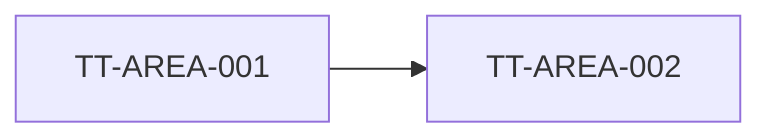

# Design - Technical Mode

Use this mode for codebase-aware technical requirements, technical design, and technical tasks. Technical Design is intentionally split across three files because it can be large.

## Purpose

Create:

- `technical-requirements.md` for `TR-*` requirements and correctness properties;
- `technical-design.md` for architecture, data, API/service, security, observability, migration, rollout, and risk design;
- `technical-tasks.md` for `TT-*` implementation tasks and handoff to Delivery.

## Files

Write to:

- `02-design/technical-design/technical-requirements.md`;
- `02-design/technical-design/technical-design.md`;
- `02-design/technical-design/technical-tasks.md`.

Update `traceability.md` with every `TR-*`, `TD-*`, and `TT-*`.

## Evidence gate

Technical Design must use codebase or system evidence when it would affect implementation. Do not create implementation commitments from assumptions unless they are clearly labelled and non-blocking.

Classify evidence:

- repository files, APIs, schemas, services, tests, routes, screens, migrations;
- observed product behaviour;
- external provider documentation if relevant and current;
- approved upstream design files.

If codebase context is unavailable and the design depends on it, mark the affected `TR-*` or `TT-*` as `Blocked`.

## Workflow

1. Read `qualify.md`, `traceability.md`, all relevant Design files, and current code/system evidence.
2. Load/read and apply `$architecture-standards` when available before making material decisions about boundaries, owners, source of truth, public contracts, persistence, async workflows, auth/tenancy, shared abstractions, operability, cost, or maintainability.
3. If codebase context is material and `$graphify` is available, create or update the graph before finalizing technical requirements or implementation slicing. Record graph outputs and signals in `quality-gates.md`.
4. Identify missing upstream product, UX, process, or solution decisions and route them back.
5. Create or update technical requirements that map to `BR-*`, `UX-*`, `PR-*`, and `SD-*`.
6. Define technical decisions and architecture.
7. Define implementation tasks with dependencies, done criteria, validation, affected files/components where known, and expected quality gates.
8. Update `traceability.md`, `quality-gates.md`, and `qualify.md`.

## Technical requirements output

Use this structure:

```markdown
# Technical Requirements

Status: In progress
Owner: TBC
Last updated: YYYY-MM-DD
Source artefacts: 02-design/requirements.md, 02-design/solution-design.md, repository evidence
Blocks: none

## Technical evidence status
| Source | Used for | Confidence | Notes |
|---|---|---|---|

## Quality gate inputs
| Gate | Used / skipped | Evidence | Design impact |
|---|---|---|---|

## Upstream alignment matrix
| BR / UX / PR / SD | Technical implication | TR IDs |
|---|---|---|

## Technical requirements
| ID | Requirement | Maps to | Acceptance / correctness property | Status |
|---|---|---|---|---|
| TR-AREA-001 |  | BR-AREA-001 |  | Draft |

## Non-functional requirements
| ID | Requirement | Driver | Validation |
|---|---|---|---|

## Correctness properties
| ID | Property | Must hold because | Validation |
|---|---|---|---|

## Constraints and assumptions

## Open technical decisions
```

## Technical design output

Use this structure:

```markdown
# Technical Design

Status: In progress
Owner: TBC
Last updated: YYYY-MM-DD
Source artefacts: technical-requirements.md, solution-design.md, repository evidence
Blocks: none

## Technical evidence summary

## Architecture decision summary
| TD ID | Decision | Options considered | Rationale | Consequence | Related TRs |
|---|---|---|---|---|---|

## Architecture Standards alignment
| Area | Owner / boundary | Rule or invariant | Enforcement / verification | Status |
|---|---|---|---|---|

## As-is architecture

## To-be architecture


## Data model / source of truth

## API / service design

## Permissions and security

## Error, edge and failure handling

## Observability and supportability

## Migration, compatibility and rollout

## Risks and mitigations

## Validation strategy

## Open questions / decisions needed
```

## Technical tasks output

Use this structure:

```markdown
# Technical Tasks

Status: In progress
Owner: TBC
Last updated: YYYY-MM-DD
Source artefacts: technical-requirements.md, technical-design.md
Blocks: none

## Execution waves
| Wave | Goal | Depends on | Exit criteria |
|---|---|---|---|

## Technical tasks
| ID | Task | Maps to TRs | Affected area | Dependencies | Done criteria | Validation | Required quality gates | Status |
|---|---|---|---|---|---|---|---|---|
| TT-AREA-001 |  | TR-AREA-001 |  |  |  |  | Architecture, QA, diff-review | Draft |

## Dependency graph



## QA handoff
| TT ID | Validation need | Suggested TC IDs |
|---|---|---|

## Delivery planning recommendation
```

## Review gates

Technical Requirements are not ready unless each `TR-*` maps to upstream Design and has validation criteria.

Technical Design is not ready unless architecture, data, permissions, errors, observability, migration/rollout, and risk are covered where relevant.

Technical Tasks are not ready unless each `TT-*` maps to `TR-*`, has dependencies, done criteria, validation, required quality gates, and a delivery handoff.

Do not mark technical files `Done` until `traceability.md` includes the full chain from `BD-*` and `BR-*` to `TR-*` and `TT-*`.
