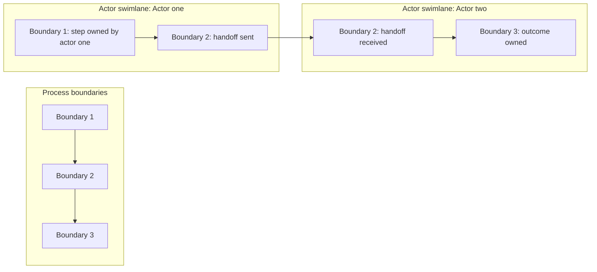

# Design — Process Design Mode

Use this mode when creating or updating a linked child task with `Lifecycle = Design` and `Stage = Process Design`.

Process Design Mode defines the business/operational process. It explains how work moves from trigger to outcome, who owns each step, what decisions happen, what records change, and what exceptions exist.

## Purpose

Process Design should define:

- as-is process;
- to-be process;
- canonical end-to-end process design where the demand spans multiple actors, handoffs, finance/compliance controls, or detailed process tasks;
- business capability alignment and process implications where the demand creates or materially changes business capabilities;
- triggers;
- actors and responsibilities;
- steps;
- process boundaries, including where one bounded operating process hands off to another;
- actor swimlanes where the process crosses multiple roles, teams, systems, providers, or external parties;
- handoffs;
- decisions;
- records/states created or changed;
- cost, fee, deduction, reserve, FX, and currency handling steps where the process touches payments, verification, payout, withdrawal, subscriptions, or settlement;
- exceptions/escalations;
- operating model impact;
- process acceptance/readiness criteria.

Process Design is not technical architecture and not UI design.

## Business capability alignment

When a demand creates or materially changes how the business operates, Process Design consumes the Discovery/Shaping `Business capability model` and `Business capability impact assessment` where they exist. Do not create a duplicate Process Design task named `Business capability model` for the same demand.

Use the capability model as the business input for process design: map capabilities to triggers, actors, handoffs, decisions, records/states, controls, exceptions, measures, support responsibilities, cost/fee/currency events, and process readiness criteria.

If no Discovery/Shaping capability model exists and the process impact is material, route the gap back to Shaping or create the Discovery/Shaping guidance task first. Only create a Process Design capability refinement if the user explicitly asks for a deeper process-owned capability view or the existing Discovery artefact is too high-level for process ownership decisions. If created, name it clearly as a refinement such as `Business capability process refinement`, not `Business capability model`.

Use BIZBOK/TOGAF alignment as an internal quality bar only. Do not write methodology sections such as `Capability model purpose`, `Standards alignment`, or explanations of BIZBOK/TOGAF into the demand artefact unless the user explicitly asks for methodology documentation.

## Canonical end-to-end process design

For complex or cross-cutting demands, create or update a canonical Process Design task named `End-to-end process design`.

Use this task as the single combined logical operating flow that ties the detailed Process Design tasks together. It should show how all relevant processes connect from first trigger to final outcome across actors, process boundaries, handoffs, decisions, records/states, controls, exceptions, finance/currency events, and downstream detailed process tasks.

Create/update this task when a demand spans multiple operating processes, actors, finance/settlement/payout/subscription events, compliance gates, admin controls, reporting, or ERP/finance close implications.

The end-to-end process design must:

- state the process purpose, scope, entry point, exit point, and non-goals;
- describe the combined process logic in business language from trigger to final business outcome;
- show each bounded process as a clear section or swimlane, such as onboarding/readiness, monetisation, purchase/entitlement, settlement/classification, funding/payout, reporting/admin/ERP controls, or the demand-specific equivalents;
- show actor swimlanes inside or alongside those boundaries so it is clear which actor, team, system, provider, or external party performs each material step;
- make handoffs between process boundaries explicit;
- identify actors, owners, and decision rights for each boundary;
- define key decisions, records/states changed, controls, exceptions, and escalation points;
- include cost, fee, deduction, reserve, FX, currency, settlement, revenue recognition, payout, withdrawal, subscription, or discount handling where relevant;
- link or name the detailed Process Design tasks that sit under each boundary so the combined view is traceable back to the underlying process artefacts;
- trace back to Requirements and forward to Solution and Technical Design where the process depends on system responsibilities or data flow.

It is not a solution architecture, screen journey, lightweight summary, or replacement for detailed process tasks.

## Diagram and FigJam handling

Follow the core skill's Diagram and FigJam contract.

Process diagrams must show actor swimlanes. This applies to all Process Design diagrams, including detailed process tasks and the canonical end-to-end process design. Boundaries show the bounded operating process areas; swimlanes show who performs or owns each material step.

Do not treat nested actor groups inside process-boundary sections as sufficient if the result does not read as swimlanes. The diagram must make actor lanes visually obvious, preferably as horizontal lanes that persist across the relevant process boundaries for left-to-right process flows. Each lane should have a clear lane label, a visible lane band or container, and the steps performed by that actor placed inside the lane rather than floating between lanes. Cross-lane handoffs should be routed from the source step to the receiving actor's lane with labelled connectors.

Process diagrams must remain process/flow diagrams. Do not convert a process diagram into an executive summary, responsibility matrix, static card layout, or capability-style overview in order to make it readable. Readability fixes must preserve the process structure: start/end events, tasks/activities, gateways/decisions, sequence flow, handoffs, exceptions, stage/process boundaries, and actor swimlanes. Use BPMN-style conventions where practical in FigJam: rounded-rectangle activity boxes, diamond gateways for decision points, clear start/end markers, labelled sequence flows, actor lanes, visible stage/process-boundary containers, and explicit handoff lines. A process diagram is acceptable only when a reviewer can trace the path through the lanes and understand who performs each step.

Use consistent process shapes. All process steps, activities, records/states, stage containers, boundary containers, lane labels, notes, start markers, and end markers should be square/rectangular with small rounded corners. Text inside these boxes must be centred horizontally and vertically. They should not render as pills or soft blobs. If FigJam shape-with-text rounded rectangles become too pill-shaped, use frame/rectangle-based boxes with text inside so the radius can be controlled. Only decision points should use a diamond/gateway shape. Do not mix in ovals, circles, hexagons, triangles, or other decorative shapes for ordinary process content.

Do not place multiple process nodes in the same actor-lane/stage cell unless the layout deliberately allocates enough vertical space for each node and connector route. A decision gateway must not sit on top of, inside, or directly underneath an activity box. If a profile/review step leads into a decision, give the decision its own stage column by default. Avoid backward looping connectors over previous boxes; branch outcomes should usually move forward into their own outcome column or lane slot. Do not accept a process diagram where gateway labels, connector labels, or connector lines overlap each other or pass through activity boxes.

Process diagram readability must be fixed through layout quality, not simplification. Preserve all material steps, gates, exceptions, records/states, actors, providers, finance events, controls and handoffs. Use a white containing canvas, enough lane and node spacing, full labels without truncation, labelled elbowed connectors, and clean connector routing. The hard no-overlap QA gate applies: no line may cross through a box/text/label, no box or background may cover another element, and no text may be clipped or ellipsised. Lane containers and stage/process-boundary containers must sit behind the process nodes and must not cover nodes, labels, connectors, connector labels, or arrowheads. Run visual QA and fix the layout before treating the FigJam view as complete.

Prefer a clean process-backbone layout over a cramped matrix when the process has many handoffs. Use a square/rectangular white canvas, stage/process-boundary headers across the top, actor swimlane bands down the page, and a clear left-to-right backbone for the main process path. Place branch outcomes in their own forward columns instead of looping backwards across previous boxes. Keep generous routing corridors between columns so labelled elbow connectors can travel without crossing boxes. This should read more like a disciplined architecture/process map than a dense spreadsheet of nodes.

For FigJam Process Design pages, use this house style unless the user explicitly asks for a different visual treatment:

- one square/rectangular white canvas behind the full diagram with no pill-shaped outer container;
- stage or bounded-process headers across the top;
- actor swimlanes down the page, with clear lane labels and subtle lane bands;
- process activities, records/states, notes, stage labels, lane labels, start markers, and end markers as square/rectangular boxes with small rounded corners;
- text centred horizontally and vertically inside every process box;
- only decision gateways use a diamond shape;
- elbowed connectors, not freeform curved connectors, for process flow;
- every connector has a short label that explains the handoff, trigger, event, decision outcome, state change, or control movement;
- decisions get their own stage/process column by default;
- branch outcomes move forward into their own columns or lane slots instead of looping backwards across previous content;
- no old/generated layers should remain on a rebuilt FigJam process page. Hard-clear the target page after loading it before redrawing.

If the process structure, content, stage boundaries, swimlanes, labels, and box layout are correct but a small number of connector routes still need cosmetic line adjustment in FigJam, do not keep regenerating the whole process page and risk losing a good layout. Note the line-cleanup need in chat and leave the editable FigJam objects in place for manual adjustment, unless the user explicitly asks for another automated reroute.

For the canonical `End-to-end process design`, the Mermaid diagram and any FigJam page must show the major process boundaries from left to right and actor swimlanes that persist across those boundaries. A good layout is usually a grid: bounded process areas as vertical columns, actor swimlanes as horizontal rows, and activities placed at the column/row intersection where that actor performs the work. When FigJam work is in scope, create/update a matching FigJam page. Do not insert FigJam URLs, embeds, bookmarks, markdown links, preview blocks, or generic FigJam link lists into the Process Design task as part of this mode. Do not export static images by default.

When detailed Process Design tasks exist below the canonical end-to-end process, create or update a separate FigJam page for each meaningful detailed process diagram as well as the combined `End-to-end process design` page. Do not treat the combined e2e process page as a substitute for detailed process diagrams such as eligibility/readiness, monetisation or product setup, buyer purchase/entitlement, settlement/classification, funding/payout, subscription/discount billing, admin exceptions, reporting, or ERP/reconciliation when those processes are distinct review artefacts.

Each detailed process FigJam page must follow the same readability bar as the core diagram contract: white containing canvas, actor swimlanes where multiple actors participate, clear process boundary, readable full labels, and connector routing that does not cross through boxes or obscure labels. It must also pass the hard no-overlap QA gate before it is linked or treated as complete. If the process has one primary actor but uses systems/providers/admin/support, still show those as lanes when they perform checks, write states, return provider statuses, handle exceptions, or complete handoffs.

Do not use a process diagram to describe system integration or data architecture. If the key question is how systems, providers, ledgers, ERP, APIs, or source-of-truth records interact, route that diagram to Solution Design.

## Notion mapping

Create or update a **linked child task**.

Task properties:

| Task field | Expected value |
|---|---|
| `Task` | Process-focused name describing the end-to-end outcome. |
| `Lifecycle` | `Design`. |
| `Stage` | `Process Design`. |
| `Status` | Use a valid live task status. |
| `Priority` | Align to parent unless process risk requires different priority. |
| `Project` | Relation to parent demand. |

## Inputs to use

Use:

- parent Discovery/Shaping;
- approved Requirements;
- UX Design where screens/flows inform process;
- existing operational notes;
- known policies/rules;
- existing Process task if refining.

Do not use Technical Tasks or Development tasks as the process source of truth.

## Minimum fact base

Before finalising process design, identify:

1. Trigger.
2. Desired outcome.
3. Actors and roles.
4. Current/as-is behaviour if known.
5. Future/to-be behaviour.
6. Decision points.
7. Handoffs and ownership.
8. Records/states created or changed.
9. Cost/fee/currency handling points, including who owns the cost, when it is estimated, disclosed, deducted, recovered, absorbed, reconciled, or escalated.
10. Exception paths and escalation.
11. Operating model impact.
12. Business capabilities created, changed, reused, retired, or needing validation where the demand has material operating-model impact, using the Discovery/Shaping capability artefacts where they exist.
13. For cross-cutting demands, the bounded process areas that make up the end-to-end process and the detailed Process Design tasks that sit beneath each boundary.

If ownership or as-is process is unknown, mark it explicitly. Do not invent operational owners.

## Process workflow

1. Identify process purpose.
2. Identify trigger and outcome.
3. Identify actors and responsibilities.
4. Read the Discovery/Shaping `Business capability model` and `Business capability impact assessment` when they exist; route back to Shaping if they are missing and materially needed.
5. For cross-cutting demands, create or refresh the canonical `End-to-end process design` task before or alongside detailed process tasks.
6. Document current/as-is process where known.
7. Document future/to-be process.
8. Identify process boundaries, actor swimlanes, and handoffs between them.
9. Identify decision points and rules.
10. Identify records/states created or updated.
11. Identify cost/fee/currency handling steps and controls where relevant.
12. Identify handoffs and ownership.
13. Identify exceptions and escalations.
14. Evaluate operating model impact.
15. Define process acceptance/readiness criteria.
16. Review against requirements, business scenarios, and the Discovery/Shaping capability artefacts where they exist.

## Output contract

Write this structure in the child task body.

```markdown
# Process Design

## Source context
| Source | Used for |
|---|---|
| Parent demand | ... |
| Requirements | ... |
| UX Design | ... |
| Operational notes | ... |

## Process purpose
...

## Trigger and outcome
| Trigger | Outcome |
|---|---|
| ... | ... |

## Actors and responsibilities
| Actor | Responsibility | Decision rights |
|---|---|---|
| ... | ... | ... |

## As-is process
...

## To-be process
...

## Process boundaries
| Boundary | Purpose | Entry point | Exit point | Owner | Downstream detailed process task |
|---|---|---|---|---|---|
| ... | ... | ... | ... | ... | ... |

## Actor swimlanes
| Actor / swimlane | Steps owned | Decisions owned | Handoffs received | Handoffs sent |
|---|---|---|---|---|
| ... | ... | ... | ... | ... |

## Business capability alignment
| Capability | Level | Relationship | Process implication |
|---|---|---|---|
| ... | L1/L2/L3 | New / extend / change / reuse / retire / uncertain | ... |

## Process flow
...



## Decision points
| Decision | Options | Owner | Notes |
|---|---|---|---|
| ... | ... | ... | ... |

## Records / states changed
| Record/state | Created/updated by | Notes |
|---|---|---|
| ... | ... | ... |

## Cost, fee and currency handling
| Cost / fee / currency event | Process step | Owner | Control / disclosure | Record updated |
|---|---|---|---|---|
| ... | ... | ... | ... | ... |

## Exceptions and escalations
| Exception | Handling | Owner |
|---|---|---|
| ... | ... | ... |

## Operating model impact
| Area | Impact |
|---|---|
| People | ... |
| Process | ... |
| Governance | ... |
| Support | ... |
| Operations | ... |

## Process acceptance criteria
...

## Open questions / decisions needed
...

## Handoff notes
...
```

## Review gate

Before marking Process Design ready:

- Is the trigger clear?
- Is the desired outcome clear?
- Where the demand introduces material operating change, has Process Design consumed the Discovery/Shaping capability model and impact assessment where they exist?
- Are actors and responsibilities clear?
- Is as-is separated from to-be?
- Are decisions and handoffs explicit?
- Are process boundaries clear, and are handoffs between boundaries explicit?
- Are actor swimlanes visually clear, with lane labels, lane bands, steps inside the owning actor lane, and cross-lane handoffs routed cleanly?
- Are state/record changes clear?
- Are cost, fee, deduction, reserve, FX and currency handling points clear where the process touches payments, verification, payout, withdrawal, subscriptions, settlement, or ERP close?
- Are exceptions covered?
- Is operating model impact named?
- Are capabilities mapped to value streams/processes, owners, records/states, controls, measures, and downstream design implications?
- Are ownership gaps surfaced rather than hidden?

## Guardrails

Do not:

- turn process design into backend design;
- hide ownership gaps;
- invent owners or teams;
- ignore exception paths;
- skip as-is/to-be where current behaviour exists;
- write generic process maps that do not tie to the demand scenario.
