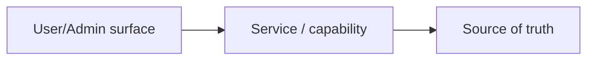
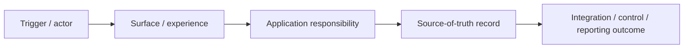

# Design — Solution Design Mode

Use this mode when creating or updating a linked child task with `Lifecycle = Design` and `Stage = Solution Design`.

Solution Design Mode defines the conceptual product/system solution. It sits between requirements/process/UX and technical implementation.

## Purpose

Solution Design should define:

- as-is and to-be solution view;
- end-to-end solution architecture for complex, cross-cutting, multi-stage, financial, operational, or integration-heavy demands;
- conceptual system responsibilities;
- source-of-truth decisions;
- cost, fee, deduction, reserve, currency, FX, and financial-event source-of-truth decisions where relevant;
- data objects and lifecycle at a conceptual level;
- API/integration concepts where relevant;
- permissions, policy, and control implications;
- dependencies and risks;
- alignment to business scenarios and requirements;
- what Technical Design must validate or implement.

Solution Design is not code-level technical design and not development task planning.

## Notion mapping

Create or update a **linked child task**.

Task properties:

| Task field | Expected value |
|---|---|
| `Task` | Solution-focused name describing the capability or solution outcome. |
| `Lifecycle` | `Design`. |
| `Stage` | `Solution Design`. |
| `Status` | Use a valid live task status. |
| `Priority` | Align to parent unless solution risk differs. |
| `Project` | Relation to parent demand. |

### Canonical end-to-end architecture task

For complex demands where the solution spans multiple actors, systems, ledgers, integrations, journeys, or operational handoffs, create or update a canonical Solution Design task named `End-to-end solution architecture`.

Use this task as the single cross-cutting design artefact that describes the whole target solution from trigger to final business outcome. It should synthesise the parent Discovery/Shaping, Requirements, UX, Process, Business capability model, High-level solution design, and detailed Solution Design tasks. It should not replace the more detailed domain-specific Solution Design tasks; it ties them together and makes the end-to-end design reviewable in one place.

This task must not be lightweight. It is not a recap, quick summary, or diagram-only page. It is the detailed solution architecture that lets a reviewer understand how the full demand works across product surfaces, business capabilities, source-of-truth records, services, integrations, controls, reporting, finance/ERP outputs, and downstream Technical Design validation.

The `End-to-end solution architecture` task must include:

- the architecture purpose, scope, and non-goals;
- a detailed narrative description of the target solution from entry point through final business outcome;
- the main actors, surfaces, business capabilities, application responsibilities, source-of-truth records, integrations, controls, reporting outputs, and ERP/accounting outputs;
- the major data objects, financial events, state transitions, and lifecycle checkpoints where relevant;
- the owner of each material invariant, policy decision, validation rule, permission rule, financial calculation, status change, and external handoff;
- a Mermaid architecture or flow diagram showing the end-to-end solution, preferably left-to-right for readability;
- a source-of-truth and responsibility matrix;
- an integration and boundary summary covering provider systems, internal services, admin surfaces, user-facing surfaces, and downstream reporting/ERP consumers;
- a table mapping each part of the end-to-end flow to the relevant Requirements, UX, Process, Solution, and Technical Design artefacts;
- open decisions that materially affect the end-to-end design, with the affected requirement/process/system/finance/legal area named.

For payments, subscriptions, payout, verification, seller earnings/royalties, reporting, ledger, ERP, multi-currency, compliance, or admin-control demands, the end-to-end architecture must explicitly cover the financial architecture: collection, settlement, recognition/classification, fees, deductions, discounts, reserves, FX, funding, payout instruction, reconciliation, ledger/source-of-truth records, reporting, audit trail, and ERP handoff. Do not collapse financial design into a vague statement such as "finance handles this" or "the backend records it".

The task should stay conceptual. It should not prescribe code files, implementation tickets, database migrations, or framework-level mechanics unless they are already approved target constraints. Put codebase validation and implementation detail in Technical Design.

## Diagram and FigJam handling

Follow the core skill's Diagram and FigJam contract.

Solution diagrams must show system responsibilities, integration boundaries, source-of-truth records, data/event flow, provider handoffs, reporting/ERP outputs, controls, and reconciliation points where relevant. They must not collapse into a generic process map. If the diagram is primarily about who does what operationally, route that view to Process Design.

Use ArchiMate-style architecture discipline where practical for high-level and detailed Solution Design FigJam diagrams. This means the diagram should make the architecture viewpoint explicit: business actors/capabilities/services, application services/components, data objects/source-of-truth records, technology or integration services, external providers, and governance/control or finance/reporting boundaries where relevant. Label relationships clearly using practical architecture semantics such as triggering, flow, access/read-write, serving, realisation, assignment/responsibility, composition, aggregation, event publication, import/export, funding, settlement, reconciliation, or reporting output.

Default Solution Design FigJam diagrams to a logical architecture view. The primary diagram should normally show product/admin/external entry points on the left, Recipe Room application services inside a clearly labelled platform boundary in the centre, source-of-truth records and data objects on the right, and external providers, payment systems, bank/multi-currency accounts, ERP/accounting, reporting, notification, compliance, or support consumers outside the platform boundary. Show labelled relationships for service responsibility, read/write ownership, event publication, provider import/export, settlement, funding, payout, reconciliation, reporting, ERP posting, audit, and control flows.

Use the same reusable visual design pattern used by the canonical end-to-end logical architecture view as the standard for all Solution Design architecture diagrams. This does not mean copying the specific end-to-end diagram content. It means applying the same diagram design: left-side entry points or product/admin surfaces, central Recipe Room platform/service boundary, right-side source-of-truth records, external provider/ERP/reporting/bank/payment systems outside the platform boundary, rounded-corner boxes, clean straight or lightly-routed relationship lines, and enough whitespace for relationship labels. Scale the number of nodes and boundaries to the task scope, but do not change the diagram type into a linear swimlane, row table, process map, or simple column traceability diagram.

Do not use a row-by-row column template as the main Solution Design diagram for complex, financial, integration-heavy, data-heavy, or cross-service demands. A surface-to-service-to-record-to-provider column view can be useful as a secondary responsibility or traceability summary, but it does not replace the logical architecture map when the reviewer needs to understand service ownership, source-of-truth ownership, provider boundaries, data/event movement, or finance/ERP movement.

For logical architecture maps, use generous spacing by default. Keep clear gutters between the entry/surface area, platform service boundary, source-of-truth records, and external providers so connector labels do not sit on top of nodes or each other. Prefer a wider canvas with fewer cramped crossings over a compact canvas. If a relationship label cannot fit cleanly between two nodes, move the nodes apart, shorten the label, route the connector through clearer whitespace, or split the view.

Domain-level Solution Design diagrams should still be logical architecture maps. Do not build them as six parallel rows where each row repeats `surface -> service -> record -> provider`; that is a traceability view, not the primary architecture view. Instead, arrange the domain's services into logical clusters inside the Recipe Room platform boundary, show the service-to-service interactions that matter, place source-of-truth records beside the services that own or write them, and place external providers/ERP/reporting systems outside the platform boundary. Use rounded-corner rectangles for every node; do not use cylinder/database shapes unless the user explicitly asks for formal data-store notation.

Do not turn the artefact into an ArchiMate methodology page. Use ArchiMate as a clarity standard for layered architecture views, not as ceremony. If FigJam cannot support formal ArchiMate notation cleanly, use consistent colours, boundaries, legends, labels, and relationship names instead of forcing icons. Do not use BPMN/process swimlanes for solution architecture unless the page is explicitly a process view; process ownership belongs in Process Design.

For the canonical `End-to-end solution architecture`, the Mermaid diagram and any FigJam view should show the combined solution architecture across Recipe Room product/admin/backend/data responsibilities, internal services, source-of-truth records, external providers, app-store payment collection, Stripe platform/payout systems, bank/multi-currency accounts, reporting, ERP/accounting, controls, failure paths, reconciliation, and data/event flows. It is a synthesis of the detailed artefacts, not a copy of the end-to-end process. When FigJam work is in scope, create/update a matching FigJam view. Do not insert FigJam URLs, embeds, bookmarks, markdown links, preview blocks, or generic FigJam link lists into the Solution Design task as part of this mode. Do not export static images by default.

Do not compress the canonical architecture into a small executive overview. For large or integration-heavy demands, the diagram should be detailed enough to review service responsibilities, source-of-truth records, provider integrations, event/import/export flows, ledger/ERP handoffs, reporting/control points, and exception paths. Prefer a larger, cleaner FigJam canvas with readable service-level detail over a compact diagram that hides material architecture.

Apply the same FigJam quality bar to every meaningful Solution Design diagram, not only the canonical end-to-end architecture. When detailed Solution Design tasks contain distinct diagrams for commerce, entitlement, payments, settlement, payout, subscription/discount, reporting, ERP/accounting, admin controls, data/source-of-truth, or provider integrations, create/update separate FigJam pages for those diagrams as well. Do not let the end-to-end architecture page substitute for domain-level solution diagrams when those diagrams are separate review artefacts.

Every Solution Design FigJam page must use a white containing canvas, full readable labels, clean connector routing, and enough spacing to show system responsibilities, data/event movement, provider handoffs, ledgers, records, and controls without lines crossing through boxes or text.

Solution diagram readability must be fixed through layout quality, not by dropping architecture detail. Preserve material systems, services, source-of-truth records, providers, events, ledgers, reporting outputs, ERP/accounting handoffs, controls, exception paths and data flows. The hard no-overlap QA gate applies: no line may cross through a box/text/label, no box or background may cover another element, and no text may be clipped or ellipsised. Run visual QA and fix the layout before treating the FigJam view as complete.

## Inputs to use

Use:

- parent Discovery/Shaping;
- approved Requirements;
- Business capability model where one exists;
- Business capability impact assessment where one exists;
- High-level solution design where one exists;
- UX Design where relevant;
- Process Design where relevant;
- existing domain-specific Solution Design tasks;
- approved Technical Design artefacts only as validation context, not as the source of product scope;
- known system/data/admin/app context;
- existing Solution task if refining.

Do not use Development tasks as the solution source of truth.

## Minimum fact base

Before finalising Solution Design, identify:

1. Business scenarios and requirement groups.
2. Business capabilities created, changed, extended, reused, retired, or requiring validation where a capability model exists.
3. Whether an `End-to-end solution architecture` task is required because the demand is complex, cross-cutting, financial, operational, integration-heavy, or spans multiple detailed solution areas.
4. Affected product/admin/app surfaces.
5. Affected actors, journeys, processes, operational handoffs, provider handoffs, and admin controls.
6. Key records/data objects and state transitions.
7. Source-of-truth candidates and write authorities.
8. Cost/fee/currency records and source-of-truth candidates where payments, subscriptions, verification, payout, FX, provider fees, reserves, or ERP posting are in scope.
9. System responsibilities at a conceptual level.
10. Permission, policy, compliance, audit, and control implications.
11. Existing capabilities that should be reused.
12. New capabilities likely required.
13. Data/reporting/ERP consumers and their required outputs.
14. Failure, exception, retry, reconciliation, and manual intervention points where material.
15. Dependencies and risks.
16. Open decisions that block Technical Design.

If the current system is unknown, state what Technical Design must validate.

When current system evidence exists, do not treat it as the target design by default. Classify each material capability/data object/source of truth as net-new, landing on existing, extending existing, changing existing, replacing legacy, or uncertain/transitional. Call out when schema/model evidence may be as-is only and the demand may intentionally change it.

## Solution workflow

1. Read parent demand and Requirements.
2. Read the Business capability model where one exists.
3. Read UX and Process where relevant.
4. Decide whether the demand needs a canonical `End-to-end solution architecture` task. Create or update it when the solution spans multiple detailed solution areas or when an end-to-end review boundary is useful.
5. Define solution purpose.
6. Document current/as-is solution if known.
7. Document target/to-be solution.
8. Classify the relationship between as-is evidence and to-be design: net-new, land on existing, extend existing, change existing, replace legacy, or validate uncertain/transitional.
9. Map business capabilities to conceptual data, systems, services, integrations, permissions, and source-of-truth decisions.
10. Identify conceptual data/source-of-truth.
11. Identify cost/fee/currency source-of-truth where relevant: provider charge, customer charge, seller deduction, platform absorbed cost, reserve, FX estimate/actual, settlement currency, accounting currency, ERP posting and reporting/audit trail.
12. Identify system/service responsibilities.
13. Identify API/integration concepts if relevant.
14. Identify permissions/policy implications.
15. Identify dependencies and risks.
16. Map solution decisions to requirements/scenarios.
17. Define what Technical Design must validate.
18. If there is an `End-to-end solution architecture` task, reconcile it back against every detailed Solution Design task and every material Requirement, UX, and Process task so the golden thread is explicit.
19. Run the Solution Design review gate.

## Output contract

Write this structure in the child task body.

````markdown
# Solution Design

## Source context
| Source | Used for |
|---|---|
| Parent demand | ... |
| Requirements | ... |
| UX Design | ... |
| Process Design | ... |
| Business capability model | ... |
| High-level solution design | ... |
| Related Solution Design tasks | ... |

## Solution purpose
...

## As-is solution view
...

## To-be solution view
...

## Current-to-target classification
| Capability / data object / source of truth | Current evidence | Target relationship | Notes |
|---|---|---|---|
| ... | ... | Net-new / land on existing / extend existing / change existing / replace legacy / uncertain-transitional | ... |

## Solution architecture map
...



## Capabilities
| Capability | Reuse / new / extend | Notes |
|---|---|---|
| ... | ... | ... |

## Business capability alignment
| Business capability | Solution responsibility | Data / source of truth | System / service | Notes |
|---|---|---|---|---|
| ... | ... | ... | ... | ... |

## Conceptual data / source of truth
| Data object | Source of truth | Created/updated by | Notes |
|---|---|---|---|
| ... | ... | ... | ... |

## Cost, fee and currency source of truth
| Cost / fee / currency object | Source of truth | Created/updated by | Consumed by | Notes |
|---|---|---|---|---|
| ... | ... | ... | ... | ... |

## System / service responsibilities
| System / service / surface | Responsibility |
|---|---|
| ... | ... |

## Permissions and policy implications
...

## Dependencies
...

## Risks and constraints
...

## Requirement / scenario alignment
| Requirement / scenario | Solution coverage |
|---|---|
| ... | ... |

## Technical Design validation points
- ...

## Open questions / decisions needed
...
````

For the `End-to-end solution architecture` task, use the same structure, but make the following sections explicit and substantive:

````markdown
# End-to-end Solution Architecture

## Architecture purpose and scope
[State the demand outcome this architecture supports, the journeys and business capabilities included, and what is deliberately out of scope.]

## End-to-end architecture narrative
[Describe the full target solution from entry point through final outcome. Cover users/actors, app/admin surfaces, business capabilities, application responsibilities, provider integrations, source-of-truth records, state transitions, controls, reporting, and finance/ERP outputs where relevant. This should be detailed enough that someone can follow how the demand works without reading every supporting task first.]

## End-to-end architecture diagram
...



## Actor, surface and responsibility map
| Actor / surface / service | Responsibility | Owns / does not own | Notes |
|---|---|---|---|
| ... | ... | ... | ... |

## Source-of-truth and control matrix
| Business object / rule / status / financial event | Source of truth | Write authority | Read consumers | Controls / invariants |
|---|---|---|---|---|
| ... | ... | ... | ... | ... |

## Data, state and event lifecycle
| Lifecycle point | Created / changed data | State transition | Trigger | Owner | Failure / reconciliation path |
|---|---|---|---|---|---|
| ... | ... | ... | ... | ... | ... |

## Integration and boundary summary
| Boundary / integration | Direction | Purpose | Contract owner | Failure / retry / reconciliation consideration |
|---|---|---|---|---|
| ... | ... | ... | ... | ... |

## Financial, reporting and ERP architecture
| Event / output | Source record | Calculation / classification | Consumer | Audit / reconciliation treatment |
|---|---|---|---|---|
| ... | ... | ... | ... | ... |

## End-to-end design traceability
| Flow area | Requirement source | UX source | Process source | Solution source | Technical validation |
|---|---|---|---|---|---|
| ... | ... | ... | ... | ... | ... |

## Open decisions and architecture risks
| Decision / risk | Why it matters | Affected artefacts | Owner / next action |
|---|---|---|---|
| ... | ... | ... | ... |
````

## Review gate

Before marking Solution Design ready:

- Does it align to Requirements?
- Does it align to UX/Process where relevant?
- Does it consume the Business capability model where one exists?
- Does it consume the Business capability impact assessment and High-level solution design where they exist?
- For complex or cross-cutting demands, is there a canonical `End-to-end solution architecture` task, or an explicit rationale for not creating one?
- If an `End-to-end solution architecture` task exists, is it a detailed architecture artefact rather than a lightweight summary?
- If an `End-to-end solution architecture` task exists, does it describe the full target design and include a Mermaid end-to-end architecture diagram?
- Where the artefact includes high-level or detailed architecture diagrams, do they use ArchiMate-style layering, relationship labelling, and viewpoint discipline where useful without turning into methodology documentation?
- If an `End-to-end solution architecture` task exists, does it cover actors, surfaces, business capabilities, application responsibilities, source-of-truth records, integrations, controls, reporting, ERP outputs, state transitions, failures, and reconciliation where relevant?
- If an `End-to-end solution architecture` task exists, does it trace each material flow area back to Requirements, UX, Process, Solution, and Technical Design validation?
- Are source-of-truth decisions clear?
- Are conceptual data objects clear?
- Are cost, fee, reserve, currency, FX and ERP/source-of-truth decisions clear where relevant?
- Are system responsibilities clear enough for Technical Design?
- Are permissions/policy implications named?
- Are dependencies and risks visible?
- Are open decisions marked?
- Is it conceptual, not code-level?

## Handoff to Technical Design

Solution Design is ready for Technical Design when:

- requirements are stable enough;
- source-of-truth candidates are clear;
- major solution responsibilities are defined;
- open decisions are either resolved or explicitly marked;
- Technical Design knows what to validate in the codebase.

## Guardrails

Do not:

- write implementation tasks;
- pretend current architecture is known without evidence;
- skip source-of-truth decisions;
- hide permission/policy implications;
- introduce unrelated system scope;
- turn conceptual design into code instructions.
