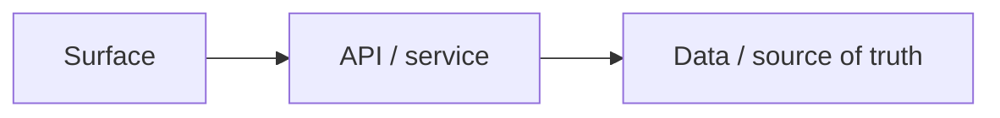

# Design — Technical Design Mode

Use this mode only when a demand is in `Lifecycle = Design` and `Stage = Technical Design`.

Technical Design Mode is the Notion Demand equivalent of a spec-driven technical planning mode. It must be as rigorous as the software spec skill, but adapted to Notion demand management rather than writing `.spec` files.

It must produce exactly three linked child task artefacts for the parent demand:

1. `Technical Requirements`
2. `Technical Design`
3. `Technical Tasks`

These are Design-stage tasks. They are not Development tasks.

## Purpose

Technical Design Mode turns approved product/design context into an implementation-ready technical plan without starting implementation.

It should:

- validate the current/as-is codebase or architecture where repo context exists;
- identify the impacted app/backend/admin/data/integration surfaces;
- identify impacted payment, payout, verification, fee, FX/currency, settlement, Stripe, Apple/Google, bank, ERP, and reporting surfaces where relevant;
- distinguish current-state from target-state;
- convert product requirements into technical requirements;
- design the to-be technical approach;
- split large demands into technical slices;
- create dependency-aware technical tasks;
- define correctness and validation properties;
- preserve traceability back to Requirements/UX/Process/Solution;
- avoid inventing product scope;
- avoid creating Development tasks unless explicitly asked.

## Notion mapping

Technical Design Mode creates or updates these exact linked child tasks.

| Task | Lifecycle | Stage | Purpose |
|---|---|---|---|
| `Technical Requirements` | `Design` | Technical Design | Translate product/design context into EARS-style technical requirements, non-functional requirements, constraints, and correctness properties. |
| `Technical Design` | `Design` | Technical Design | Define as-is/to-be architecture, data/API/service design, dependencies, risks, technical decisions, and validation approach. |
| `Technical Tasks` | `Design` | Technical Design | Produce dependency-aware technical work plan and execution waves that can later generate Development tasks. |

All three tasks must link to the parent demand through `Project`.

Do not prefix these task names with the demand name. Use the generic task names exactly unless an existing workspace convention requires otherwise.

## Source context allowed

Use only context that belongs upstream of Technical Design:

- parent demand Discovery/Shaping;
- linked Requirements tasks;
- linked UX Design tasks;
- linked Process Design tasks;
- linked Solution Design tasks;
- supplied repo/code context;
- supplied architecture notes;
- existing Technical Design artefacts if refining.

Do not use Development, QA, Launch, or Review tasks as source-of-truth inputs.

## Diagram and FigJam handling

Follow the core skill's Diagram and FigJam contract.

Technical Design should include diagrams only where they materially clarify implementation planning: technical architecture, data/source-of-truth model, state model, sequence flow, dependency graph, rollout/migration flow, or validation flow. Mermaid in Notion is the source diagram. When FigJam work is in scope, create/update a matching FigJam view. Do not insert FigJam URLs, embeds, bookmarks, markdown links, preview blocks, or generic FigJam link lists into Technical Design artefacts as part of this mode. Do not export static images by default.

Do not use Technical Design diagrams to create new product scope. If the visual exposes a missing business rule, UX state, process handoff, or solution/source-of-truth decision, route that gap back to the earliest affected mode.

Technical diagrams must preserve the implementation-relevant detail they are meant to review. Do not drop services, records, state transitions, dependencies, validation paths, migrations, rollout steps, correctness checks, or failure paths to make the diagram easier to draw. Use a white containing canvas, readable full labels and clean connector routing. The hard no-overlap QA gate applies: no line may cross through a box/text/label, no box or background may cover another element, and no text may be clipped or ellipsised. Run visual QA and fix the layout before treating the FigJam view as complete.

## Hard technical evidence gate

Before finalising Technical Requirements, Technical Design, or Technical Tasks, gather the minimum technical fact base available.

Where repo/code context exists, identify it as current-state evidence first. Do not assume schema/model/route/component evidence is the target design; it may be outdated, transitional, partial, or intentionally being replaced by the demand. For each material surface or data model, classify whether the demand is net-new, lands on existing capability, extends existing capability, changes existing capability, replaces legacy capability, or requires validation because the current state is uncertain/transitional.

Where repo/code context exists, identify:

1. Repository or codebase context used.
2. Primary product/admin/user/system flows affected.
3. Concrete modules, routes, components, controllers, services, schemas, jobs, stores, or configs likely affected.
4. Existing related implementation patterns.
5. Adjacent callers/consumers/producers that could break.
6. Impacted tests or validation surfaces.
7. Runtime, deployment, permissions, auth, data, migration, rollout, or operational constraints.
8. Existing data models or source-of-truth entities.
9. Existing cost/fee/currency/settlement records or source-of-truth entities where payments, payout, verification, subscriptions, FX, Stripe, Apple/Google, bank accounts, or ERP are in scope.
10. Cross-cutting risks: auth, permissions, privacy, performance, reliability, observability, support, maintainability.
11. Delivery correctness risks: ambiguous intent, missing surfaces, overbuild, underbuild, stale assumptions, conflicting requirements.

If repo/code context is missing or weak:

- say that explicitly in all three artefacts;
- mark assumptions;
- add Open Questions or Decision Needed;
- do not present speculative implementation commitments as final;
- keep downstream Development task creation blocked until technical validation is possible.

## Spec type decision

At the start of Technical Design Mode, decide the technical planning type.

| Spec type | Use when |
|---|---|
| Feature Spec | New or materially changed capability. Default for most product/platform work. |
| Bugfix Spec | Existing behaviour is wrong, broken, inconsistent, or regressed. |
| Quick Plan | Small, low-risk, well-understood change with clear requirements and minimal blast radius. |

Quick Plan is not allowed for:

- moderation, permissions, payments, entitlements, data migrations, reporting/audit, security, privacy, or other high-risk stateful work;
- ambiguous requirements;
- cross-surface changes;
- work where repo context is missing.

## Technical IDs and traceability

Use stable IDs.

Recommended formats:

- Technical requirements: `TR-[AREA]-001`
- Technical decisions: `TD-[AREA]-001`
- Technical tasks/slices: `TT-[AREA]-001`
- Correctness properties: `CP-[AREA]-001`

Do not use `REQ-*` or `BR-*` for technical requirements. `BR-*` is the business requirement namespace from Requirements Mode. Older Requirements tasks may still expose `REQ-*`; treat those as upstream business requirement IDs, not technical IDs.

Traceability must be clear:

- technical requirements cite upstream business requirement refs where available, using `BR-*` or legacy `REQ-*` only in the source/traceability column;
- design decisions cite technical requirements;
- technical tasks cite technical requirements and design decisions;
- validation/correctness properties map to the requirements they prove.

If upstream requirements have no IDs, reference the relevant requirement section/name and recommend adding IDs.

## Cross-mode alignment rule

Technical Design must not become a second source of product requirements. It translates approved upstream design into implementation-ready technical requirements.

Before finalising Technical Requirements:

1. Map each material `TR-*` to one or more upstream business requirements (`BR-*` or legacy `REQ-*`), UX tasks, Process tasks, or Solution tasks.
2. If a technical requirement cannot be traced to upstream scope, classify it as:
   - an implementation necessity implied by upstream scope;
   - a non-functional/security/reliability requirement needed to safely deliver upstream scope; or
   - an upstream gap.
3. If it is an upstream gap, update or route back to the earliest affected mode first: Requirements for product/business behaviour, UX for screens/states/content, Process for ownership/handoffs/exceptions, or Solution for source-of-truth/data/system responsibility.
4. Do not silently add new product behaviour inside `Technical Requirements`.
5. Include an alignment matrix showing how Requirements, UX, Process, and Solution inputs are covered or intentionally not covered.

## Technical Design workflow

1. Read the parent demand.
2. Read linked Requirements, UX, Process, and Solution tasks relevant to this demand.
3. Decide spec type: Feature Spec, Bugfix Spec, or Quick Plan.
4. Build the source context map.
5. Build the technical evidence map.
6. Identify missing upstream decisions.
7. If requirements are missing or materially unclear, stop and route back to Requirements Mode.
8. If solution/source-of-truth is missing for a complex change, route back to Solution Design Mode or mark Decision Needed.
9. Write or update `Technical Requirements`.
10. Audit Technical Requirements against parent, requirements, and evidence.
11. Write or update `Technical Design`.
12. Audit Technical Design against Technical Requirements and evidence.
13. Write or update `Technical Tasks`.
14. Audit Technical Tasks against Technical Requirements and Technical Design.
15. State readiness for Development Planning.

## Technical Requirements output contract

Write this into the `Technical Requirements` child task.

```markdown
# Technical Requirements

## Spec type decision
Feature Spec / Bugfix Spec / Quick Plan, with rationale.

## Source context used
| Source | Used for |
|---|---|
| Parent demand | ... |
| Requirements | ... |
| UX Design | ... |
| Process Design | ... |
| Solution Design | ... |
| Repo/code context | ... |

## Technical evidence status
| Area | Evidence | Current-to-target relationship | Confidence | Notes |
|---|---|---|---|---|
| Current architecture | ... | High/Medium/Low | ... |
| Existing pattern | ... | ... | ... |
| Data/source of truth | ... | ... | ... |
| Tests/validation | ... | ... | ... |
| Permissions/security | ... | ... | ... |
| Runtime/ops | ... | ... | ... |
| Payments / cost / currency | ... | ... | ... |

## Requirement analysis findings
- ...

## Upstream alignment matrix
| Technical requirement | Product/business requirement | UX alignment | Process alignment | Solution alignment | Notes |
|---|---|---|---|---|---|
| TR-... | BR-... / legacy REQ-... | ... | ... | ... | ... |

## Technical requirements
| Ref | Technical requirement | Product requirement / scenario | Validation |
|---|---|---|---|
| TR-... | WHEN ..., THE SYSTEM SHALL ... | ... | ... |

## Payment, cost and currency technical requirements
| Ref | Technical requirement | Upstream source | Validation |
|---|---|---|---|
| TR-... | WHEN ..., THE SYSTEM SHALL ... | BR-... / Solution / Process | ... |

## Non-functional requirements
| Ref | Requirement | Target / rule | Validation |
|---|---|---|---|
| NFR-... | ... | ... | ... |

## Correctness properties
| Ref | Property | Proves | Validation approach |
|---|---|---|---|
| CP-... | ... | ... | ... |

## Constraints
...

## Assumptions
...

## Open questions / decisions needed
...

## Readiness for Technical Design
Ready / blocked, with rationale.
```

Technical requirements should use EARS where useful:

```text
WHEN [condition/event], THE SYSTEM SHALL [expected technical behaviour].
```

## Technical Design output contract

Write this into the `Technical Design` child task.

```markdown
# Technical Design

## Spec type decision
...

## Source context used
...

## Technical evidence summary
...

## Spec slicing
| Slice | Purpose | Requirements covered | Notes |
|---|---|---|---|
| ... | ... | ... | ... |

## As-is architecture
Describe the current architecture or current uncertainty.

## To-be architecture
Describe the intended technical shape.

## Architecture map
[Keep the Mermaid diagram visible in this section. If a matching FigJam view exists, do not insert its URL or preview here; provide the FigJam page name and URL in chat if the user needs it for manual placement.]



## Data model / source of truth
| Entity / record | Current evidence | Target source of truth | Change needed | Notes |
|---|---|---|---|---|
| ... | ... | ... | ... |

## Payment, cost and currency design
| Area | Technical design responsibility | Provider / system | Validation needed |
|---|---|---|---|
| Store settlement | ... | Apple / Google / ERP | ... |
| Multi-currency account | ... | Bank / ERP | ... |
| Verification / IDV costs | ... | Platform IDV provider / Stripe | ... |
| Payout / withdrawal fees | ... | Stripe / backend / ERP | ... |
| FX / conversion | ... | Stripe / ERP | ... |

## API / service design
| Endpoint / service / function | Responsibility | Inputs | Outputs | Notes |
|---|---|---|---|---|
| ... | ... | ... | ... | ... |

## Permissions and security
...

## Error, edge and failure handling
...

## Observability / supportability
...

## Migration / compatibility / rollout
Only include where relevant.

## Technical decisions
| Ref | Decision | Rationale | Requirements covered |
|---|---|---|---|
| TD-... | ... | ... | ... |

## Risks and mitigations
...

## Validation strategy
...

## Open questions / decisions needed
...

## Readiness for Technical Tasks
Ready / blocked, with rationale.
```

## Technical Tasks output contract

Write this into the `Technical Tasks` child task.

```markdown
# Technical Tasks

## Spec type decision
...

## Source context used
...

## Execution status summary
| Status | Count / notes |
|---|---|
| Todo | ... |
| Blocked | ... |
| Ready for Development Planning | ... |

## Execution waves
| Wave | Purpose | Dependencies | Exit criteria |
|---|---|---|---|
| 1 | ... | ... | ... |

## Technical tasks
### TT-[AREA]-001 — [Task name]
- Status: Todo / Blocked / Deferred
- Requirements covered: TR-...
- Design decisions covered: TD-...
- Dependencies:
- Workstreams:
- Validation:
- Risks:
- Development mapping:

## Dependency graph
...

## Validation and QA handoff
...

## Development Planning recommendation
...

## Blockers / decisions needed
...
```

Technical Tasks should be detailed enough to later create Development tasks, but they are not themselves build execution records.

## Bugfix-specific rules

For Bugfix Spec, Technical Requirements must separate:

- current behaviour;
- expected behaviour;
- unchanged behaviour/regression prevention.

Technical Design must explain:

- likely defect location;
- blast radius;
- regression risk;
- validation needed to prove the fix.

Technical Tasks must include:

- reproduce/confirm bug task;
- fix task;
- regression validation task;
- release/monitoring note where relevant.

## Net-new feature rules

Even for net-new work, validate the existing architecture.

Ask:

- Where should this capability live?
- What existing module/surface is closest?
- What existing data model or pattern should be reused?
- What could break if this is bolted on incorrectly?
- What existing permissions/auth patterns apply?

Do not assume net-new means no blast radius.

## Review gates

### Technical Requirements gate

Do not mark ready unless:

- requirements trace to parent/design context;
- technical evidence status is clear;
- assumptions and open questions are separated;
- correctness properties exist for risky/stateful/permissioned/data work;
- no critical product requirement is missing.

### Technical Design gate

Do not mark ready unless:

- as-is and to-be are separated;
- source-of-truth/data design is clear where relevant;
- payment, cost, fee, settlement, FX/currency, provider-charge and ERP-posting design is clear where relevant;
- permissions/security are considered where relevant;
- failure/edge handling is covered;
- risks and decisions are documented;
- validation strategy is clear.

### Technical Tasks gate

Do not mark ready unless:

- tasks trace to technical requirements and design decisions;
- dependencies are clear;
- tasks are executable without guessing;
- blockers are not hidden;
- downstream Development Planning can create outcome-based build tasks from them.

## Handoff to Development Planning

Technical Design can hand off to Delivery — Development Planning when:

- the three technical artefacts exist;
- no critical Decision Needed item blocks implementation;
- technical tasks are dependency-aware;
- validation/QA handoff is explicit;
- any repo/context gaps are either resolved or clearly marked as pre-development validation tasks.

## Guardrails

Do not:

- create Development tasks unless user asks;
- rewrite Discovery or Requirements silently;
- invent architecture without evidence;
- treat old Development tasks as source of truth;
- mix unrelated demands;
- create generic frontend/backend/API/data top-level tasks without tying them to outcomes;
- skip current-state validation because the work feels net-new;
- mark implementation-ready if critical technical evidence is missing.
