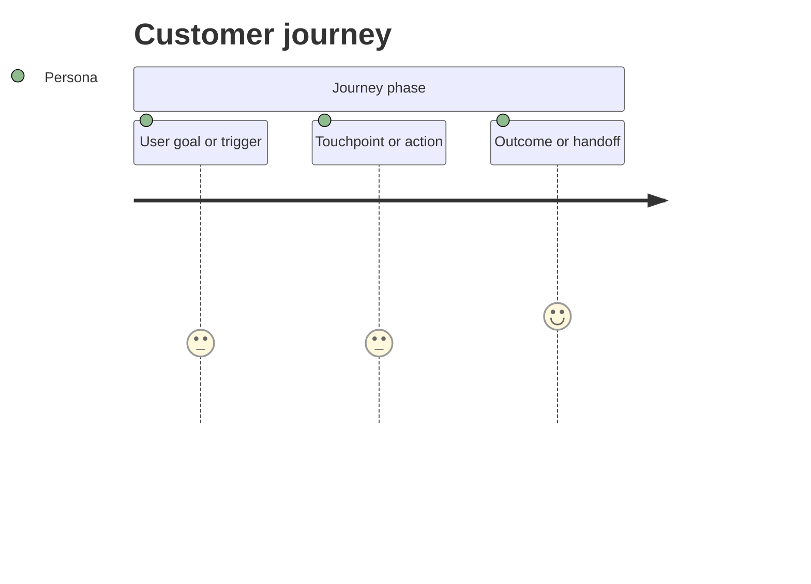
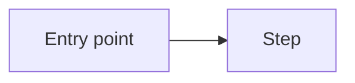
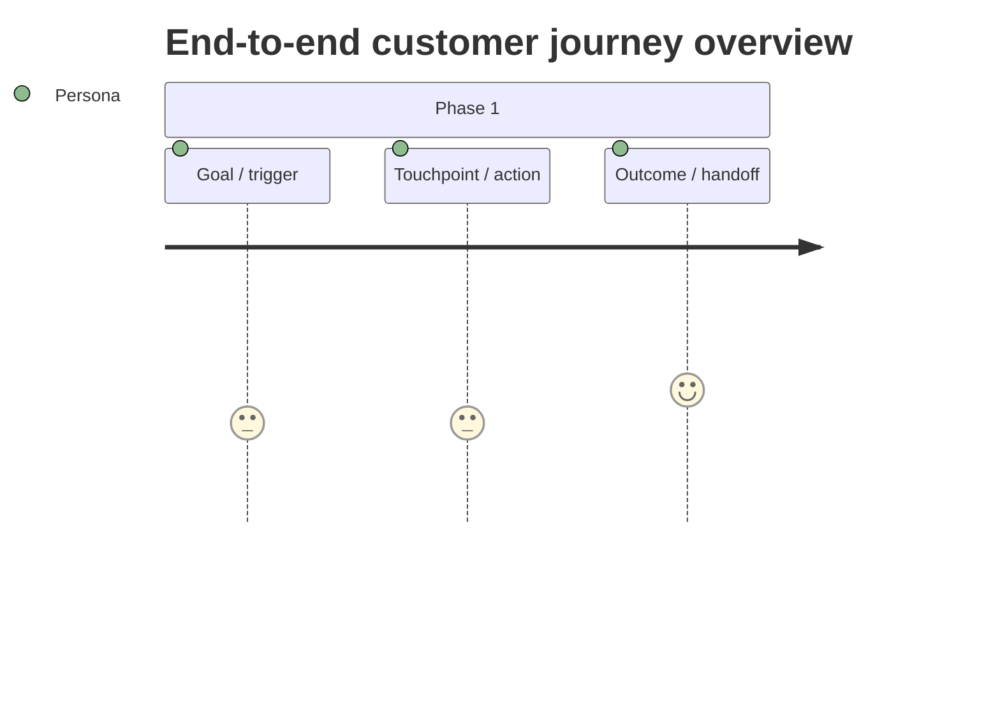
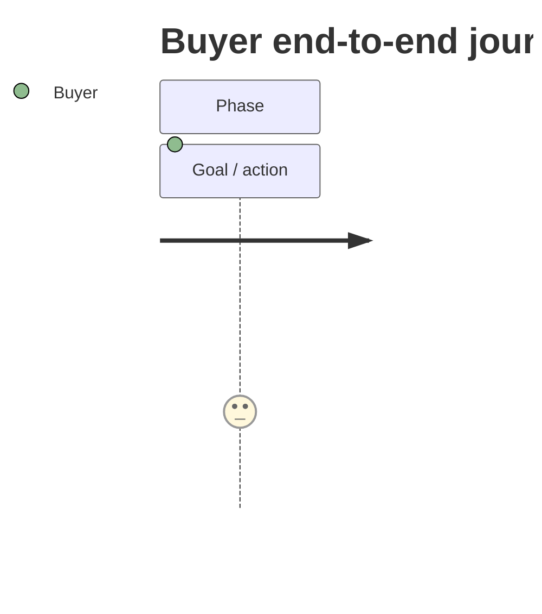
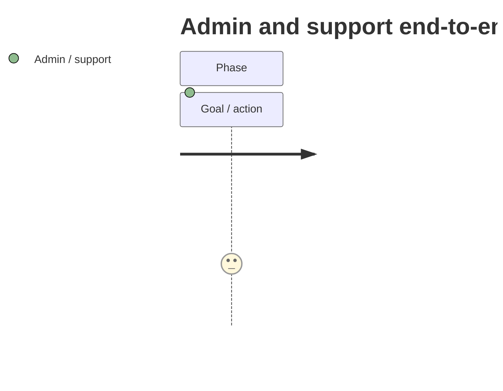

# Design — UX Design Mode

Use this mode when creating or updating a linked child task with `Lifecycle = Design` and `Stage = UX Design`.

UX Design Mode defines the user/admin experience: screens, flows, interactions, states, content labels, and design asset mapping.

## Purpose

UX Design Mode turns requirements and scenarios into clear experience direction.

It should define:

- user/admin journey;
- task-specific customer journey flow for the UX task's own surface, screen group, or interaction scope;
- canonical end-to-end customer journey where the demand spans multiple personas, surfaces, or journey phases;
- screen inventory;
- entry points;
- flows and decision points;
- screen states;
- permissions and state-specific UI;
- content and label rules;
- accessibility considerations;
- design assets and source-file mapping;
- UX acceptance criteria;
- handoff needs for Process, Solution, Technical Design, and QA.

UX Design is not requirements authoring, process ownership design, solution architecture, or technical implementation planning.

## Canonical end-to-end customer journey

For demands that span multiple personas, surfaces, screen groups, or journey phases, create or update a canonical UX Design task named `End-to-end customer journey`.

Use this task as the lightweight end-to-end journey hub that ties detailed UX tasks together. It should show how the overall experience hangs together across personas, phases, touchpoints, visible decisions and cross-persona handoffs, but it must not become a dumping ground for every detailed persona journey.

Create/update this task when a demand includes multiple customer personas, buyer/seller sides, admin/support assisted journeys, onboarding plus transaction plus reporting journeys, or several UX tasks that need one coherent customer story.

The `End-to-end customer journey` task must:

- stay UX/customer-experience focused rather than becoming a process map or solution architecture;
- synthesise the parent Shaping high-level customer journey, Requirements, business scenarios, and detailed UX tasks;
- identify personas and journey phases;
- show key touchpoints, surfaces, decisions, visible states, and handoffs that shape the customer experience;
- include a concise Mermaid overview journey or flow and, when FigJam work is in scope, a matching FigJam page named `UX Design - End-to-end customer journey`;
- link or name the detailed UX tasks that own each phase, screen group, or touchpoint.

For multi-sided or materially different personas, keep one canonical Notion task named `End-to-end customer journey`, but split the content inside that task into clear persona-specific journey sections. Do not create separate Notion tasks for each persona-specific end-to-end journey unless the user explicitly asks for separate task ownership. Split the journey sections when personas have different goals, entry points, surfaces, decisions, states, risks, or controls.

Expected split pattern:

- Notion task `End-to-end customer journey`: one task containing the overview, persona split rationale, cross-persona handoffs, task ownership, and separate detailed sections for each material persona or actor group.
- Inside that one task, use separate sections such as `Seller end-to-end journey`, `Buyer end-to-end journey`, and `Admin and support end-to-end journey`.
- FigJam page uses the stage-prefixed canonical name `UX Design - End-to-end customer journey` and contains separate visual journey maps for each material persona or actor group.

Do not use one blended journey map as the only detailed map when buyer, seller, admin/support, finance, or provider journeys are meaningfully different. Keep the Notion artefact as one task and keep the FigJam artefact as one page, but make the persona journeys separate sections/maps inside those artefacts so the visuals remain reviewable. Do not create separate persona-specific FigJam pages unless the user explicitly asks for separate page ownership.

The canonical UX end-to-end journey must be materially more detailed than the Shaping journey. Shaping preserves the high-level business/customer path. UX must add screen groups, entry points, staged steps, user actions, visible UI states, decision points, permissions/role differences, empty/loading/error/success states where relevant, moments of success, outcome/handoff, and the UX task that owns each phase.

Use this design-thinking detail model for canonical and task-specific UX journeys:

| Level | Meaning |
|---|---|
| Journey lens | Persona/actor, scenario, goal/job-to-be-done, trigger, start point, end point, scope boundary, source evidence and confidence. |
| Stage / phase | A major part of the journey, such as readiness, purchase, re-access, payout, support or admin approval. Stages run left to right. |
| Stage goal / question | What the actor is trying to resolve during that stage. |
| Step / moment | A concrete ordered moment inside the stage. Use as many steps as that stage needs; do not force every stage to have the same number of steps. |
| Step objective | What the actor needs to achieve in this specific moment. |
| Step description | A short plain-English description of what this step is about, placed above the activities so the reader has context before reading the action details. |
| Activities performed | The specific things the actor does in that step. This must be more detailed than the step title. |
| Touchpoints / surfaces | Screen, entry point, component, modal, toast, provider handoff, admin view, support surface, email/notification or other channel involved. |
| Visible state / decision | What state, choice, permission, validation, status, restriction or decision is visible to the actor. |
| Thoughts / questions | What the actor is likely thinking, checking, worrying about, or trying to understand at that moment. |
| Emotional state / confidence | How the moment feels: confident, uncertain, blocked, reassured, frustrated, relieved, motivated, etc. |
| Pain points / friction / risks | What could confuse, block, delay, mislead, worry, or create a control/compliance/support risk. |
| Moment of success / truth | How the actor knows the step worked, what must be true, or what reassurance must be visible. |
| KPI / measure | The observable signal that this step is working, such as completion, drop-off, retry, conversion, support contact, time-to-complete, error rate, approval time, or payout success. |
| Opportunity / design implication | What the UI/content/state model should do to reduce friction, create trust, recover failure, or make the next step clear. |
| Owner / linked UX task | The UX task or screen group that owns the detailed design. |
| Evidence / open question | Source, assumption, unresolved detail or decision that could change the journey. |
| Backend activities | The backstage, system, provider, admin, record, event, entitlement, ledger, notification, audit, or support activity that makes the visible step work. Use `None / not material` only when there is genuinely no meaningful backend/backstage activity for that step. |

A UX journey is too shallow if it has one card per stage, uses only `action/state/success`, omits the step description, omits the activities the user performs, omits thoughts/questions or emotions/friction, omits pain points and opportunities, lacks touchpoints/surfaces, lacks KPIs/measures, lacks backend activities, or cannot show what the actor actually does inside a stage. Add multiple steps inside a stage when the actor reviews information, opens screens/modals, makes a choice, accepts terms, waits for validation, receives confirmation, sees a state change, compares options, reviews money, retries, escalates, or needs a recovery path. Do not force a repeated two-step pattern; a stage should have the number of steps its real journey deserves.

For FigJam journey maps, the visual structure must be horizontal at both levels: stages/phases run left to right, and the ordered step groups inside each stage also run side-by-side from left to right. Each stage can have a different number of steps. Do not force two steps per stage or any other uniform count. Each step group must have a distinct step header box, with separate labelled detail tiles underneath for objective, description, activities, touchpoints, visible state/decision, thoughts, emotion/confidence, pain/friction, moment of success, KPI/measure, opportunity/design implication, owner/handoff, evidence/open question, and a bottom `Backend activities` tile. `Description` sits above `Activities`. Do not put all step detail into one dense card. Notion may use tables for traceability, but the FigJam map should make progression across stages and progression between steps visually obvious.

## Notion mapping

Create or update a **linked child task**.

Task properties:

| Task field | Expected value |
|---|---|
| `Task` | UX-focused name describing the surface, flow, or interaction outcome. |
| `Lifecycle` | `Design`. |
| `Stage` | `UX Design`. |
| `Status` | Use a valid live task status. |
| `Priority` | Align to parent unless a specific UX priority differs. |
| `Project` | Relation to parent demand. |
| `Files` | Source design files, HTML, Figma exports, PDFs, or supporting source docs where supplied. |
| `Media` | Extracted screenshots/images/assets from the source design files. |

If file properties exist, source files go in `Files` and extracted images go in `Media`. Do not use the page body as file storage unless the properties are unavailable.

## Diagram and FigJam handling

Follow the core skill's Diagram and FigJam contract.

Each UX Design task should include a customer journey flow for the scope of that task. This task-specific journey flow should show the persona, scenario, journey phase, stage goal, step, step objective, step description, activities performed, touchpoint/surface, visible state or decision, thoughts/questions, emotional state or confidence, pain/friction, moment of success, KPI/measure, opportunity/design implication, backend activities, and outcome for the screen group or flow being designed. Keep detailed UX tasks scoped to their own screen group; the only task that should carry the whole demand's persona-specific journeys is the canonical `End-to-end customer journey` task.

Use a UX flow diagram when it clarifies screen order, entry points, decisions, permissions, locked/unlocked states, empty/error/success states, or admin/user journey differences. Mermaid in Notion is the source flow. When FigJam work is in scope, create/update a matching FigJam view. Do not insert FigJam URLs, embeds, bookmarks, markdown links, preview blocks, or generic FigJam link lists into the UX task as part of this mode. Do not export static images by default.

Do not turn UX diagrams into process ownership maps or solution architecture. If the visual needs process boundaries, actor handoffs, data flow, integrations, or system responsibilities, route that part to Process or Solution Design.

UX diagrams and journey maps must preserve the actual customer journey and screen-state coverage. Do not drop personas, journey phases, touchpoints, screens, states, entry points, decision paths, permission variants, empty/error/success states, locked/unlocked states, thoughts/questions, emotional/friction states, pain points, opportunities, KPIs/measures, backend activities, or ownership to make the diagram easier to draw. Use a white containing canvas, enough spacing, full readable labels and clean connectors. Customer journey maps must use a left-to-right stage layout, with step groups laid side-by-side inside each stage and separate detail tiles underneath each step header, ending with a `Backend activities` tile. A one-step-per-stage, top-down-only, vertical step stack where steps should run horizontally, single dense detail-card, or `action/state/success` FigJam map fails the review gate. The hard no-overlap QA gate applies: no line may cross through a box/text/label, no box or background may cover another element, and no text may be clipped or ellipsised. Run visual QA and fix the layout before treating the FigJam view as complete.

When a canonical `End-to-end customer journey` task exists and personas are materially different, create/update one FigJam page named `UX Design - End-to-end customer journey` and place separate persona-specific maps inside that page. Do not create separate Notion tasks or separate FigJam pages for those persona journeys unless the user explicitly asks. Do not use the end-to-end task as a substitute for task-specific journey flows in detailed UX tasks, and do not use task-specific journey flows as a substitute for persona-specific end-to-end sections when the demand needs them.

Use stage-prefixed FigJam page names for every UX journey map:

- Canonical demand journey: `UX Design - End-to-end customer journey`.
- Persona-specific end-to-end journey: separate map inside `UX Design - End-to-end customer journey`, not a separate page by default.
- Task-specific journey: `UX Design - [journey or UX task name]`.
- Admin/operator UX journey: `UX Design - [admin journey or UX task name]`.

Prefer the journey name when it is already clear, for example `UX Design - Paid recipe discovery journey`. Use the Notion UX task name when that is the clearer review artefact name, for example `UX Design - Creator onboarding, terms and verification screens`. Do not create bare journey pages such as `Buyer purchase journey` without the `UX Design -` prefix. If a matching stage-prefixed FigJam page already exists, update it rather than creating a duplicate.

## Inputs to use

Use:

- parent Discovery/Shaping;
- approved Requirements;
- business scenarios;
- user-provided screenshots/files;
- existing UX task if refining;
- current design/product patterns where known;
- relevant Process/Solution only for alignment, not as source of missing requirements.

Do not use Development/QA/Launch/Review as source-of-truth for UX.

## Minimum fact base

Before finalising UX, identify:

1. Target actor/user.
2. Entry point into the flow.
3. Affected object/surface.
4. Required user actions.
5. Required screen states.
6. Permissions or viewer/owner/admin state differences.
7. Relevant content labels or copy rules.
8. Required empty/error/success states.
9. Design files or assets if supplied.
10. Requirements that the UX must satisfy.
11. Whether the demand needs a canonical `End-to-end customer journey` task because the UX spans multiple personas, surfaces, or journey phases.

If assets are missing, write the UX task as a design brief and mark missing assets clearly.

## UX workflow

1. Read parent demand and requirements.
2. Identify surfaces and entry points.
3. Identify actors and state variants.
4. Decide whether to create or refresh the canonical `End-to-end customer journey` task. Do this for multi-persona, multi-surface, marketplace, onboarding-plus-transaction, admin-assisted, or otherwise journey-heavy demands.
5. If materially different personas exist, create or update separate persona-specific end-to-end journey sections inside the canonical `End-to-end customer journey` task. Keep this as one Notion task unless the user explicitly asks for separate task ownership.
6. Map the task-specific customer journey flow for the UX task being created or updated at screen/state level. Include the journey lens, stage, stage goal, step, step objective, step description, activities performed, entry point, touchpoint/screen group, visible state, decision, thoughts/questions, emotional state or confidence, pain/friction, moment of success, KPI/measure, opportunity/design implication, backend activities, outcome, owner, and relevant edge states rather than a high-level Shaping-style summary.
7. Map the primary journey.
8. Map alternate/edge journeys.
9. Create screen inventory.
10. Define states for each screen.
11. Define content/copy/labelling rules.
12. Define accessibility and responsive considerations.
13. Map source files and screenshots to Notion properties.
14. Review against requirements and scenarios.
15. State handoff implications for Process/Solution/Technical Design.

## Screen and flow coverage checklist

Consider these areas where relevant:

| Area | UX questions |
|---|---|
| Entry point | Where does the user/admin start? |
| Primary path | What is the expected happy path? |
| Decision points | What choices does the user/admin make? |
| State differences | Owner vs viewer, admin vs non-admin, logged-in vs logged-out, eligible vs ineligible. |
| Empty states | What appears when nothing exists yet? |
| Loading states | What is shown while data loads? |
| Error states | What happens on failure or unavailable actions? |
| Success states | What confirms the action worked? |
| Reverse states | Can the user undo, unmute, unblock, restore, retry, or cancel? |
| Accessibility | Labels, focus, touch targets, contrast, keyboard/screen-reader implications. |
| Content | Titles, labels, explanatory copy, destructive-action language. |
| Assets | Which source files and screenshots belong to this UX task? |

## Output contract

Write this structure in the child task body.

````markdown
# UX Design

## Source context
| Source | Used for |
|---|---|
| Requirements | ... |
| Parent demand | ... |
| Design file / screenshot | ... |

## UX objective
...

## Users / actors
| Actor | UX need |
|---|---|
| ... | ... |

## Customer journey flow
[Map the journey for this UX task at screen/state level. Include persona, scenario, goal, trigger, start/end point, stage, stage goal, step, step objective, step description, activities performed, touchpoints/surfaces, visible state or decision, thoughts/questions, emotional state or confidence, pain/friction, moment of success, KPI/measure, opportunity/design implication, owner, backend activities, and key edge states. Do not repeat only the high-level Shaping journey.]

### Journey lens
| Field | Detail |
|---|---|
| Persona / actor | ... |
| Scenario | ... |
| Goal / job-to-be-done | ... |
| Trigger | ... |
| Start point | ... |
| End point | ... |
| Scope boundary | ... |
| Evidence / confidence | ... |

| Stage / phase | Stage goal / question | Step / moment | Step objective | Step description | Activities performed | Touchpoints / surfaces | Visible state / decision | Thoughts / questions | Emotional state / confidence | Pain points / friction | Moment of success / truth | KPI / measure | Opportunity / design implication | Owner / linked UX task | Evidence / open question | Backend activities |
|---|---|---|---|---|---|---|---|---|---|---|---|---|---|---|---|---|
| ... | ... | ... | ... | ... | ... | ... | ... | ... | ... | ... | ... | ... | ... | ... | ... | ... |



## Surface / screen inventory
| Surface / screen | Purpose | States |
|---|---|---|
| ... | ... | ... |

## User flow
...



## Interaction rules
| Rule | Applies to | Requirement ref |
|---|---|---|
| ... | ... | ... |

## Screen states
| Screen | State | Behaviour |
|---|---|---|
| ... | ... | ... |

## Content / labelling notes
...

## Accessibility notes
...

## Design assets
| Asset | Notion property | Purpose |
|---|---|---|
| source file | Files | ... |
| screenshot pack/images | Media | ... |

## UX acceptance criteria
...

## Open questions / decisions needed
...

## Handoff notes
| Next mode | Notes |
|---|---|
| Process Design | ... |
| Solution Design | ... |
| Technical Design | ... |
| QA | ... |
````

For the canonical `End-to-end customer journey` task, keep one Notion task that contains the overview plus separate persona-specific journey sections. It should not include a `Journey map set`, `FigJam page expectation`, Figma page inventory, or audit table.

````markdown
# End-to-end Customer Journey

## Journey purpose and scope
[State the demand outcome, personas, surfaces, phases, and what is deliberately out of scope.]

## Source context
| Source | Used for |
|---|---|
| Parent Shaping customer journey | ... |
| Requirements | ... |
| Business scenarios | ... |
| Detailed UX tasks | ... |

## Personas and journey goals
| Persona | Goal | Success measure / desired outcome | Notes |
|---|---|---|---|
| ... | ... | ... | ... |

## End-to-end overview
[Briefly explain how the persona-specific journeys connect. Keep this section as an overview.]



## Seller end-to-end journey
[Detailed seller journey map and key screen/state coverage.]

### Seller journey lens
| Field | Detail |
|---|---|
| Scenario | ... |
| Goal / job-to-be-done | ... |
| Trigger | ... |
| Start point | ... |
| End point | ... |
| Scope boundary | ... |
| Evidence / confidence | ... |

| Stage / phase | Stage goal / question | Step / moment | Step objective | Activities performed | Touchpoints / surfaces | Visible state / decision | Thoughts / questions | Emotional state / confidence | Pain points / friction | Moment of success / truth | KPI / measure | Opportunity / design implication | Owner / linked UX task | Evidence / open question |
|---|---|---|---|---|---|---|---|---|---|---|---|---|---|---|
| ... | ... | ... | ... | ... | ... | ... | ... | ... | ... | ... | ... | ... | ... | ... |


## Buyer end-to-end journey
[Detailed buyer journey map and key screen/state coverage.]

### Buyer journey lens
| Field | Detail |
|---|---|
| Scenario | ... |
| Goal / job-to-be-done | ... |
| Trigger | ... |
| Start point | ... |
| End point | ... |
| Scope boundary | ... |
| Evidence / confidence | ... |

| Stage / phase | Stage goal / question | Step / moment | Step objective | Activities performed | Touchpoints / surfaces | Visible state / decision | Thoughts / questions | Emotional state / confidence | Pain points / friction | Moment of success / truth | KPI / measure | Opportunity / design implication | Owner / linked UX task | Evidence / open question |
|---|---|---|---|---|---|---|---|---|---|---|---|---|---|---|
| ... | ... | ... | ... | ... | ... | ... | ... | ... | ... | ... | ... | ... | ... | ... |



## Admin and support end-to-end journey
[Detailed admin/support journey map and key screen/state coverage.]

### Admin and support journey lens
| Field | Detail |
|---|---|
| Scenario | ... |
| Goal / job-to-be-done | ... |
| Trigger | ... |
| Start point | ... |
| End point | ... |
| Scope boundary | ... |
| Evidence / confidence | ... |

| Stage / phase | Stage goal / question | Step / moment | Step objective | Activities performed | Touchpoints / surfaces | Visible state / decision | Thoughts / questions | Emotional state / confidence | Pain points / friction | Moment of success / truth | KPI / measure | Opportunity / design implication | Owner / linked UX task | Evidence / open question |
|---|---|---|---|---|---|---|---|---|---|---|---|---|---|---|
| ... | ... | ... | ... | ... | ... | ... | ... | ... | ... | ... | ... | ... | ... | ... |



## Cross-persona handoffs
| From persona / phase | To persona / phase | Handoff | UX implication | Owning task |
|---|---|---|---|---|
| ... | ... | ... | ... | ... |

## Journey risks and open decisions
| Risk / decision | Why it matters | Affected persona / phase | Owner / next step |
|---|---|---|---|
| ... | ... | ... | ... |

## Detailed UX task ownership
| UX task | Journey phase / surface covered | Personas | Notes |
|---|---|---|---|
| ... | ... | ... | ... |
````

## Pattern consolidation rule

Do not split a reusable UX pattern into separate tasks without a real reason.

Consolidate surfaces that use the same interaction pattern and acceptance criteria. Split a flow when it has materially different users, decisions, states, assets, ownership, or review needs.

## Review gate

Before marking UX ready:

- Does every screen/flow trace back to a requirement or business scenario?
- Does the UX task include a task-specific customer journey flow?
- If the demand spans multiple personas, surfaces, or phases, is there a canonical `End-to-end customer journey` task, or a clear rationale for not creating one?
- If an `End-to-end customer journey` task exists, does it trace phases back to detailed UX tasks and preserve the parent Shaping journey?
- Is the UX journey materially more detailed than Shaping, with a clear journey lens, stage-level goals, multiple steps where needed, step objectives, step descriptions, activities performed, screen groups, touchpoints, visible states, thoughts/questions, emotional state or confidence, pain/friction, opportunities/design implications, decisions, moments of success, KPIs/measures, backend activities, edge states, outcomes and owning UX tasks?
- Would the journey fail if reviewed as a design-thinking customer journey map because it has only one summary card per stage, uses only `action/state/success`, stacks steps vertically in FigJam where they should run left-to-right, crams all detail into one step card, or omits description, activities, thoughts, emotions, pain points, opportunities, touchpoints, success criteria, KPI/measure or backend activities?
- Are entry points clear?
- Are state variants clear?
- Are owner/viewer/admin differences clear?
- Are empty/loading/error/success states covered where relevant?
- Are source files and screenshots mapped to Files/Media where available?
- Is the UX pattern consolidated where it should be?
- Are open design decisions marked?

## Guardrails

Do not:

- invent requirements not approved upstream;
- leave profile/feed/detail/collection patterns split when one reusable pattern should cover them;
- put source files/screenshots in the body if Files/Media properties exist;
- make UX Design a technical implementation plan;
- hide missing requirements in design notes.
- skip the task-specific customer journey flow in a UX task unless it is explicitly not applicable;
- duplicate the entire end-to-end customer journey inside every UX task instead of keeping detailed UX tasks scoped to their own journey segment.
