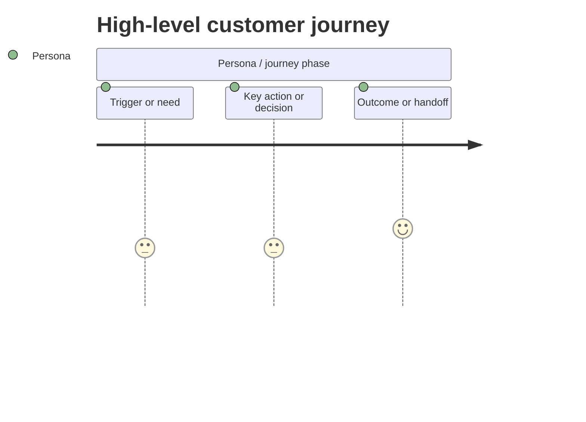
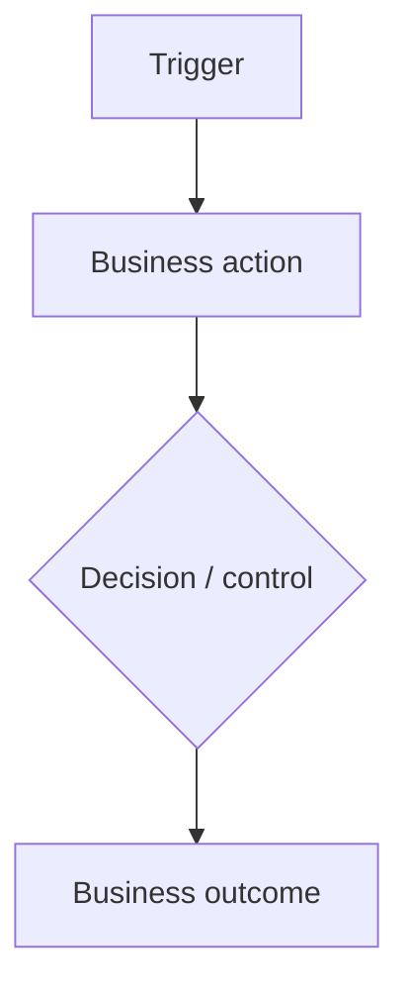

# Discovery — Shaping Mode

Use this mode when a demand is ready to be shaped into a clear parent demand direction, usually `Lifecycle = Discovery` and `Stage = Shaping`.

Shaping is the bridge between an idea and design work. It should make the demand specific enough for Requirements, UX, Process, Solution, and Technical Design to proceed without guessing.

## Purpose

Shaping Mode clarifies:

- the executive summary of how the Ideation concept is becoming a shaped demand;
- the shaped idea and product/business model;
- the selected or proposed business/model option and rationale;
- the commercial strategy definition: commercial proposition, commercial products, pricing, revenue streams, fees/commission, royalty or payout economics, subscription/discount strategy, commercial cost structure, cost ownership, sales/adoption route, support implications, and go-to-market direction;
- the alternatives rejected, parked, or left open from Ideation;
- the critical business problem;
- the opportunity and value;
- end-to-end scope;
- the end-to-end business/user journey;
- the core operating flow for complex or model-heavy demands;
- strategic decisions and design principles;
- impacted or new business scenarios;
- high-level customer journey flow based on the shaped personas and actors;
- feasibility;
- capability reuse or new capability needs;
- the business capability impact set needed to guide Design;
- the high-level solution design direction needed to guide Design;
- the downstream Design implications across Requirements, UX, Process, Solution, and Technical Design;
- operating model impact;
- risks, dependencies, assumptions, and decisions;
- recommended Design-stage focus areas.

It supports planning, business case thinking, benefits logic, capability alignment, and scope discipline. It must not turn into detailed requirements or technical design.

Shaping should build from Ideation, not repeat it. Summarise the Ideation idea briefly, then explain what Shaping has added: confirmed choices, rejected paths, operating-model consequences, design implications, risks, and decisions still needed.

## Codebase context source

Use local Recipe Room repository context when shaping needs evidence about current product behaviour, affected app/admin/backend/data surfaces, feasibility, capability reuse, integration points, source-of-truth candidates, or operating model impact.

Do not write implementation detail into the parent demand. Summarise codebase evidence as product/service context, feasibility assessment, risks, dependencies, assumptions, open questions, or recommended Design-stage focus.

## Notion mapping

Write Shaping output to the **parent demand page**.

Update parent fields where appropriate:

| Parent field | Expected use |
|---|---|
| `Lifecycle` | `Discovery`. |
| `Stage` | `Shaping`. |
| `Status` | Planning or In Progress if being actively shaped. |
| `Type` | Confirm or correct the parent demand type. |
| `Priority` | Confirm or revise based on impact and urgency. |
| `Size` | Revise using a valid live size option based on shaped scope. |
| `Summary` | Update to a clean 1-3 sentence summary. |
| `Timeline` | Set or revise a date/date range only when supported by evidence. |

Keep Shaping content on the parent demand page. Create linked Discovery tasks only when the user explicitly asks for separate task tracking or when there is a concrete follow-up outcome that needs separate ownership before Design. Do not move Shaping sections into grouped child pages by default.

For large or model-heavy demands, also create or update these Discovery/Shaping guidance tasks unless the user explicitly asks not to:

- `Business capability model`
- `Business capability impact assessment`
- `High-level solution design`

These are Discovery/Shaping guidance tasks, not Design tasks. Set `Lifecycle = Discovery`, `Stage = Shaping`, and link them to the parent through `Project`. They exist to make the handoff into Design clearer. The business capability model is a high-level business capability model for Discovery/Shaping guidance; if the demand later needs a deeper process-owned capability model, Process Design can refine it without moving the Discovery guidance artefact out of Discovery. The business capability impact assessment is a high-level capability set and operating-model impact view. The high-level solution design is a business-level direction of travel for systems, data, integrations, providers, source-of-truth candidates, and open design decisions; it must not become technical design or implementation detail.

If the parent page references Shaping guidance artefacts, keep those links simple and do not replace the parent Shaping content with links. The three guidance artefacts that may be linked are `Business capability model`, `Business capability impact assessment`, and `High-level solution design`.

If recommending Design-stage work, list it as recommended focus areas. Create Design tasks only when the user asks to progress the demand or when the stage artefact is genuinely ready to be produced.

## Diagram and FigJam handling

Follow the core skill's Diagram and FigJam contract.

Every Shaping diagram must preserve the shaped business/model detail. Do not simplify away material actors, options, money/value/data/control movements, policy gates, operating-model impacts, capability impacts, commercial logic, settlement/payout paths, or open decisions to make the diagram easier to draw.

Every Shaping FigJam page must use a white containing canvas, readable full labels, enough spacing, clean connector routing, and a visual QA pass. The hard no-overlap QA gate applies: no line may cross through a box/text/label, no box or background may cover another element, and no text may be clipped or ellipsised. If a Shaping diagram becomes too dense, split it into the relevant parent/guidance diagrams instead of compressing or dropping content.

If an existing Shaping FigJam page is cramped, bunched up, built from an older visual pattern, or difficult to read, rebuild it on a clean wider canvas instead of nudging individual nodes around. Preserve the business/model content, but replace the layout so the artefact is reviewable.

Use the right visual standard for the Shaping artefact. `Core operating flow` is a business operating flow, so it should show the shaped model, actors, handoffs, decisions, money/value/data/control movements and outcomes without becoming a system architecture. `High-level solution design` should use the reusable logical architecture visual design pattern used by Solution Design, but at a higher Shaping level: left-side product/admin/external entry points, a central Recipe Room platform/service boundary, right-side source-of-truth record groups, and external provider/payment/bank/ERP/reporting systems outside the platform boundary. Use rounded-corner boxes, readable labels, and labelled data/event/money/control flows. Do not copy detailed Solution Design content, do not use cylinder/database shapes unless explicitly requested, and do not fall back to a row-by-row traceability template. Do not write ArchiMate methodology notes into the demand; just make the diagram clearer and more reviewable.

For Shaping FigJam diagrams, use straight connectors by default, except for customer journey maps where the journey-map structure may require lanes, phases, or a different connector style. Shaping diagrams should be readable as business/design guidance, not implementation diagrams. Use rounded-corner rectangles for nodes by default. Do not use cylinder/database shapes, decorative icons, or methodology labels unless the user explicitly requests them.

For the parent high-level customer journey, create or update one stage-prefixed FigJam page named `Shaping - Customer journey map` unless the existing demand board already has a clearer equivalent stage-prefixed page. The Shaping journey content should stay high-level and business-facing, but it must still be a real customer journey map: persona/scenario lens, stages left to right, stage goals, variable key steps based on the actual size of each stage, actor activities, touchpoints/channels, visible decisions, pain/control points, opportunities/design implications, moments of success, outcomes and open decisions. Do not reduce Shaping to one vague card per stage, and do not force the same number of steps under every stage.

When Shaping customer journeys are drawn in FigJam, stages run left to right as broad sections. Inside each stage, step boxes run side-by-side left to right and each step has separate lightweight detail tiles underneath for objective, description, activities, touchpoints, pain/control point, moment of success, KPI/measure where known, opportunity/design implication, and a bottom `Backend activities` tile. `Description` sits above `Activities` so the reader understands what the step is about before the action detail. A compact Shaping map can omit lower-detail UX-only tiles, but it must not cram all step detail into one dense card.

Do not collapse materially different high-level personas into one dense Shaping journey map. Split the high-level Shaping customer journey into separate maps inside the same `Shaping - Customer journey map` page when buyer, seller, admin, support, finance, provider, or other actors have different goals, touchpoints, decisions, visible states, controls, or outcomes. Do not create separate Shaping persona pages unless the user explicitly asks for separate page ownership. Detailed screen journeys still belong in `UX Design - ...` pages.

Use these Shaping visual standards:

- `Core operating flow`: show the shaped business operating model from trigger to outcome. Use business actors, eligibility gates, commercial/value/money/data/control movements, provider handoffs, settlement/payout/reporting outcomes, and key decisions. It is not a process map and not a solution architecture diagram.
- `Business capability model`: show stable business capabilities and how they support the value stream. Use capability domains and capability boxes, with L1/L2/L3 detail where useful. Capability names should describe what the business must be able to do, not screens, database tables, vendors, or delivery tasks.
- `Business capability impact assessment`: show what the shaped model changes across capability, policy/legal, people/roles, process, technology, organisation, value, finance/commercial, reporting/control, and risk areas. This is an impact view, not a duplicate of the capability model.
- `High-level solution design`: show the high-level logical architecture direction as described above. This guidance artefact belongs to Discovery/Shaping, not the Design/Solution Design lifecycle, even though it uses the same visual design pattern as later Solution Design architecture diagrams.

For large, commercial, financial, regulated, integration-heavy, operational, or multi-actor demands, Shaping should usually include or create diagrams for:

- the parent `Core operating flow`;
- the `Business capability model` capability map;
- the `High-level solution design` conceptual flow.

Use Mermaid in the Notion parent/task body as the source diagram. When FigJam work is in scope, create/update a matching FigJam view for each meaningful Mermaid diagram. Do not insert FigJam URLs, embeds, bookmarks, markdown links, preview blocks, or generic FigJam link lists into Notion as part of this mode. Do not export static images by default. Do not put Figma process notes, connector limitations, or diagram-generation mechanics into the demand content.

For the parent `Core operating flow`, assume the diagram is meaningful for any complex, commercial, financial, regulated, operational, or multi-actor demand unless there is a clear reason not to. Document it in Mermaid and create/update the matching FigJam view when diagram work is active. Do not compress it into a generic happy-path sketch for complex demands; show the main actors, money/value/data/control movements, decisions, handoffs, eligibility gates, settlement/payout paths, and outcomes at the level needed for Shaping to guide Design.

This is true even when `Core operating flow` is only a parent-page section and not a separate task. Do not wait for or create a separate task just to justify the diagram. Create/update the FigJam page for the parent section and name it with the lifecycle/stage context such as `Shaping - Core operating flow`.

## Minimum fact base

Before completing Shaping, gather enough evidence to support Design:

1. Current parent ideation context.
2. The initial idea, product/business model, key model choices, and open questions from Ideation.
3. The high-level business/model options considered in Ideation, including why each option is preferred, rejected, parked, or still uncertain.
4. The commercial proposition and early commercial strategy from Ideation, including commercial products, pricing, subscriptions, discounts, revenue, commission, royalty/payout economics, commercial cost structure, cost ownership, sales/adoption route, support implications, and GTM posture where relevant.
5. User-provided notes, screenshots, files, or decisions.
6. Relevant current product and service context.
7. Affected users/personas or actors.
8. Affected product surfaces, services, admin areas, commercial areas, governance areas, data areas, or operational processes.
9. Known business scenarios or user journeys.
10. Known policy/rules/permissions where relevant.
11. Likely data/content needs.
12. Known dependencies.
13. Open decisions that could change scope.

If the fact base is incomplete, mark the missing areas as Open Questions or Decision Needed. Do not invent requirements.

## Shaping detail bar

Shaping adds enough substance to the Ideation concept for Design to proceed without guessing. It should still avoid detailed requirements, UI design, solution architecture, and implementation tasks.

For larger, commercial, operational, regulated, financial, or multi-actor demands, Shaping must explicitly cover:

| Area | What Shaping must clarify |
|---|---|
| Shaped idea | What exactly are we proposing now, in plain English? |
| Product/business model | How does it work as a product, service, commercial, operational, or governance model? |
| Commercial strategy | What commercial proposition, commercial products, pricing, revenue streams, fees/commission, royalties/payout economics, subscriptions, discounts, commercial costs, cost ownership, sales/adoption route, launch cohort, support implications, launch posture and GTM choices are now proposed? |
| Commercial cost structure | Which store fees, verification costs, payout/KYC costs, withdrawal fees, FX/conversion fees, bank/intermediary fees, reserves, minimums, thresholds, tax costs, provider fees, or platform-funded costs apply; who bears them; when they are incurred; how they are disclosed; and how they are recorded? |
| Option decision | Which business/model option is selected or proposed, why it is preferred, and what alternatives are rejected, parked, or kept as fallback? |
| End-to-end journey | How does the model work from trigger to outcome across user, admin, provider, finance, support, or system actors? |
| High-level customer journey flow | What are the main journey phases for each key persona, such as buyer, seller, admin, support, provider, or finance? What does each persona do, experience, decide, receive, or hand off at each major moment? What stage-specific steps does each phase actually deserve? What objectives, descriptions, activities, touchpoints, pain/control points, opportunities, outcomes, KPIs/measures, backend activities, and design implications must UX preserve? |
| Core operating flow | What is the business-level flow across the main actors, money/value/data/control movements, decisions, handoffs, and outcomes? |
| Strategic decisions | Which model choices are confirmed, rejected, or still open? |
| Design principles | Which principles should guide Requirements, UX, Process, Solution, and Technical Design? |
| Operating model assessment | What changes for the business, product, process, people, technology, organisation, value, and capabilities? |
| Design implications | Which downstream modes need to solve which parts of the shaped demand? |

## Narrative and table use

Shaping must be readable as a business/design narrative before it becomes a structured assessment. Start with a short executive summary of the actual shaped demand: the idea from Ideation, the chosen direction, the main model choices, the most important operating-model implications, and what Design must now solve.

Every substantial table should have a short demand-specific synopsis before it. Use the synopsis to summarise the actual finding, decision, option set, scenario set, or implication; use the table to organise decisions, comparisons, scenarios, or assessment detail. Do not write meta lead-ins such as "this table captures..." or explain what the framework section is for.

Use paragraphs for:

- shaping executive summary;
- product intent;
- shaped narrative and business rationale;
- problem/opportunity context where a table would fragment the story;
- benefits/business case logic;
- important risks, assumptions, or decisions that need explanation.

Use tables for:

- shaped model components;
- proposed option and option rationale;
- end-to-end journey;
- strategic decisions and design principles;
- critical business problems where comparison helps;
- opportunities and objectives where structure helps;
- core operating flow where a diagram clarifies the model;
- operating-model assessment;
- design implications;
- business scenarios;
- feasibility assessment;
- recommended Design-stage focus areas;
- follow-up or decision tasks.

## Operating model impact lens

Use this as the Shaping quality bar. This is not a lightweight table and not a request to create a generic "business engine" artefact. It is the operating-model assessment that explains what the idea means for Recipe Room as a business, product, process, technology, organisation, value model, and capability set, and what downstream Design work must handle.

For each material area, state:

- current/as-is impact or existing capability/process;
- target/to-be impact or intended change;
- whether the demand reuses, extends, changes, replaces, retires, or creates capability;
- owner, decision, risk, or open question where the impact is not settled;
- downstream mode implication, such as Requirements, Process Design, Solution Design, Technical Design, Launch, or Review.

| Area | Shaping questions |
|---|---|
| Policy | What rules, governance, approval, eligibility, privacy, safety, reporting, moderation, commercial, trust, or content policies are affected? Are existing policies enough, or do they need to change? |
| People | Which users, customers, admins, operators, support roles, reviewers, decision makers, or owners are affected? Who performs work, receives the outcome, approves decisions, or owns exceptions? |
| Process | Which end-to-end user, admin, support, operational, commercial, or governance process changes? What is the as-is process, what is the to-be process, and where are the handoffs or decisions? |
| Technology | Which app, backend, admin, data, integration, analytics, infrastructure, workflow, or tooling areas are affected? Does the demand land on existing technology, extend it, change it, or need something new? |
| Organisation | Does this change ownership, support model, escalation, governance, review responsibility, operating rhythm, cross-team responsibility, or readiness needs? |
| Value | What user, operational, revenue, trust, risk, efficiency, quality, compliance, or learning value is expected? What would make the demand worth doing? |
| Capability | Which existing capability is reused, extended, changed, replaced, or retired? Which new capability may be required? Is the capability product-facing, operational, technical, commercial, or governance-related? |

Use Strategy, goals/objectives, customer/persona, product/service, and commercial/GTM context where relevant, but do not let those replace the operating-model impact assessment above.

Do not skip the operating-model assessment for a large or model-heavy demand. If an area is uncertain, write the uncertainty and route it to the right downstream mode or decision owner.

## Business scenario structure

Use business scenarios to make scope concrete.

```markdown
### Business scenarios
| Scenario | Actor | Trigger | Desired outcome | Notes |
|---|---|---|---|---|
| ... | ... | ... | ... | ... |
```

For larger or riskier demands, add detail for priority scenarios:

```markdown
### Scenario detail: [Scenario name]
- Actor:
- Trigger:
- Current/as-is behaviour:
- Future/to-be behaviour:
- Data/content required:
- Policy/rules:
- Process/ownership impact:
- Open questions:
```

## Shaping workflow

1. Read the parent Ideation content and latest user instruction.
2. Confirm the demand name and type.
3. Write a concise shaping executive summary that references Ideation and explains what Shaping adds.
4. Restate the shaped product intent.
5. Expand the product/business model enough for Design to understand how the idea works.
6. Define the commercial strategy where material: commercial proposition, commercial products, pricing, revenue streams, fees/commission, royalties/payout economics, subscriptions, discounts, commercial cost structure, cost ownership, sales/adoption route, launch cohort, support implications, GTM direction, and commercial decisions still needed.
7. For payments, payout, seller earnings/royalties, subscriptions, verification, or multi-currency demands, define each material cost component with estimated amount or TBC marker, provider/charged-by party, economic owner, timing, recovery/absorption treatment, ledger/ERP treatment, reporting/audit treatment, currency/FX treatment, and confirmation status.
8. Confirm the selected or proposed business/model option, with rationale and rejected or parked alternatives.
9. Define the end-to-end business/user journey at a business level.
10. For multi-persona, multi-actor, marketplace, admin-heavy, commercial, or CX-heavy demands, add a high-level customer journey flow on the parent Shaping page. Base it on the target personas and actors. Keep it high-level enough for Discovery, but specific enough that UX Design can create the canonical `End-to-end customer journey` and task-specific UX journey flows without guessing.
11. For complex, commercial, financial, regulated, or multi-actor demands, add a business-level core operating flow that shows the main actors, money/value/data/control movements, decisions, handoffs, and outcomes.
12. Identify strategic decisions and design principles.
13. Identify critical business problems.
14. Identify opportunities and value.
15. Define target users/personas where relevant.
16. Define high-level product, service, operational, CX, commercial, governance, data, and technical scope.
17. Define out of scope.
18. Identify business scenarios and scenario details.
19. Assess feasibility across product, operations, technology, data, UX, and organisation.
20. Identify impacted capabilities and reuse opportunities.
21. Identify policy, people, process, technology, organisation, value, and capability impacts using the operating-model assessment.
22. For larger or model-heavy demands, create or update the `Business capability model` Discovery/Shaping task.
23. For larger or model-heavy demands, create or update the `Business capability impact assessment` Discovery/Shaping task.
24. For larger or model-heavy demands, create or update the `High-level solution design` Discovery/Shaping task.
25. Link `Business capability model`, `Business capability impact assessment`, and `High-level solution design` from the parent when they exist, without removing the parent Shaping content.
26. Add a Design implications table showing what Requirements, UX, Process, Solution, and Technical Design must preserve or resolve.
27. State benefits/business case logic.
28. Capture risks, dependencies, assumptions, and decisions needed.
29. End Discovery with current confirmed decisions and open decisions carried forward when there is material model, commercial, legal, finance, compliance, data, or technical uncertainty.
30. Recommend Design-stage focus areas.
31. Run the shaping review gate.

## Output contract

Use this structure on the parent demand page.

````markdown
## About this project
...

## Discovery

### Discovery executive summary
[2-4 short paragraphs summarising the actual Discovery findings across Ideation and Shaping: the original idea, the shaped direction, the commercial/product model, the major model choices, rejected or parked options, operating-model implications, and what Design must preserve. Do not explain the Discovery framework.]

### Shaping executive summary
[2-4 short paragraphs. Briefly name the Ideation idea, then explain the shaped direction, the main confirmed model choices, the biggest operating-model implications, and what Design must now solve. Do not explain the Discovery framework or repeat the Ideation executive summary.]

### Product intent
...

### Shaped idea and model
[Briefly summarise the actual shaped product/business model, including who acts, who receives value, what is controlled, the key model choices, and decisions still needed.]

| Area | Direction |
|---|---|
| Shaped idea | ... |
| Product / business model | ... |
| Who acts | ... |
| Who receives value | ... |
| What is exchanged / controlled | ... |
| Key model choices | ... |
| Model decisions still needed | ... |

### Commercial strategy definition
[Briefly summarise the selected commercial proposition and strategy. Define what Recipe Room is offering, the commercial products, how Recipe Room makes money, pricing/fees/commission, royalties or payout economics, subscription and discount treatment, cost ownership, GTM direction, and commercial decisions that remain open. This should turn the Ideation commercial options into a coherent direction for Requirements, UX, Process, Solution and Technical Design.]

| Area | Shaped direction |
|---|---|
| Commercial proposition | ... |
| Commercial products | ... |
| Revenue streams | ... |
| Pricing / fees / commission | ... |
| Royalty / payout economics | ... |
| Subscription / discount strategy | ... |
| Commercial cost structure | ... |
| Cost ownership | ... |
| Go-to-market / launch direction | ... |
| Sales / adoption route | ... |
| Launch cohort / transition posture | ... |
| Support / enablement implications | ... |
| Commercial risks / decisions still needed | ... |

### Commercial cost structure
[Briefly summarise the material costs in the shaped model. Include provider costs, store fees, verification/IDV costs, payout/KYC costs, withdrawal fees, FX/conversion costs, bank/intermediary fees, reserves, thresholds, who bears each cost, when it is incurred, how it is disclosed, how it is recovered or absorbed, and how it must be recorded.]

| Cost component | Working amount / basis | Charged by / provider | Economic owner | Timing | Recovery / absorption treatment | Ledger / reporting treatment | Confirmation status |
|---|---|---|---|---|---|---|---|
| ... | ... | ... | Creator / Recipe Room / buyer / shared / TBC | ... | ... | ... | Confirmed / Assumption / TBC |

### Sales, pricing and go-to-market strategy
[Briefly summarise the shaped commercial route to market: who the initial audience or cohort is, how the offer is sold or adopted, what pricing and packaging are proposed, how discounts or transitions work, what launch posture is proposed, what support or enablement is needed, and which GTM decisions remain open.]

| Area | Shaped direction |
|---|---|
| Target segment / launch cohort | ... |
| Sales / adoption route | ... |
| Pricing model | ... |
| Packaging / plan strategy | ... |
| Discount / transition strategy | ... |
| Launch / rollout approach | ... |
| Support / enablement implications | ... |
| GTM risks / decisions still needed | ... |

### Proposed direction and option rationale
[Briefly summarise the selected or proposed business/model path, why it is preferred, and which options were rejected, parked, or kept as fallback. This is decision history for later strategy changes, not technical architecture.]

| Option area | Options considered | Proposed direction | Rationale | Rejected / parked / fallback options |
|---|---|---|---|---|
| ... | ... | ... | ... | ... |

### End-to-end business journey
[Briefly summarise the actual shaped business journey across the main actors.]

| Step | Actor | Trigger / action | Outcome | Design implication |
|---|---|---|---|---|
| 1 | ... | ... | ... | ... |

### High-level customer journey flow
[Briefly summarise the high-level customer journey across the material personas. Use this to preserve the customer/user story from Shaping into UX Design. For marketplace or multi-sided demands, include the buyer and seller journeys; include admin, support, provider, or finance personas only where they materially shape the customer experience. Keep this high-level and business-facing, but still document persona lens, stages, key steps, activities, touchpoints, decisions, pain/control points, opportunities, moments of success and outcomes. Detailed screen-state journeys belong in UX Design.]

| Persona | Scenario / goal | Stage | Key step | Step objective | Step description | Activities performed | Touchpoints / channels | Decision / visible state | Pain or control point | Opportunity / design implication | Moment of success / outcome | KPI / measure | Backend activities |
|---|---|---|---|---|---|---|---|---|---|---|---|---|---|
| ... | ... | ... | ... | ... | ... | ... | ... | ... | ... | ... | ... | ... | ... |

...



### Core operating flow
[Briefly summarise the actual core operating flow at business level. Use this for complex, commercial, financial, regulated, or multi-actor demands where the shape of the model matters. Show the main actors, handoffs, decisions, money/value/data/control movements, and outcomes without turning it into technical architecture.]

...



### Strategic decisions and design principles
[Briefly summarise the actual confirmed decisions, assumptions, and decisions still needed, so downstream Design knows what is stable.]

| Item | Decision / principle | Status | Downstream implication |
|---|---|---|---|
| ... | ... | Confirmed / Assumption / Decision needed | ... |

### Critical business problems
[Briefly summarise the actual business problems Shaping is solving or controlling.]

| Area | Problem |
|---|---|
| ... | ... |

### Opportunity
[Briefly summarise the actual opportunity and the value it should create.]

| Opportunity | Value |
|---|---|
| ... | ... |

### Objectives / goals
...

### Target users / personas
...

### Operating model assessment
[Briefly summarise how the shaped demand changes Recipe Room's policy, people, process, technology, organisation, value, and capabilities.]

| Area | As-is / current impact | To-be / target impact | Capability relationship | Decisions / downstream implication |
|---|---|
| Policy | ... | ... | reuse / extend / change / create / replace / retire / uncertain | ... |
| People | ... | ... | reuse / extend / change / create / replace / retire / uncertain | ... |
| Process | ... | ... | reuse / extend / change / create / replace / retire / uncertain | ... |
| Technology | ... | ... | reuse / extend / change / create / replace / retire / uncertain | ... |
| Organisation | ... | ... | reuse / extend / change / create / replace / retire / uncertain | ... |
| Value | ... | ... | reuse / extend / change / create / replace / retire / uncertain | ... |
| Capability | ... | ... | reuse / extend / change / create / replace / retire / uncertain | ... |

### Scope
...

### Out of scope
...

### Business scenarios
...

### Feasibility and shaping assessment
[Briefly summarise the actual feasibility, risk, and readiness considerations before Design continues.]

| Area | Assessment |
|---|---|
| Product | ... |
| UX | ... |
| Operational | ... |
| Technical | ... |
| Data | ... |
| Organisation | ... |
| Risk | ... |

### Capability alignment and reuse
...

### Operating model implications
Summarise the most important policy, people, process, technology, organisation, value, and capability impacts. Call out what must be resolved in Requirements, Process Design, Solution Design, Technical Design, Launch, or Review.

### Business architecture and design direction
- Business capability model: ...
- Business capability impact assessment: ...
- High-level solution design: ...

### Design implications
[Briefly summarise how the shaped demand should guide downstream Design. This is the golden-thread handoff: each mode should know what it must preserve, define, or challenge.]

| Design mode | What it must preserve or resolve |
|---|---|
| Requirements | ... |
| UX Design | ... |
| Process Design | ... |
| Solution Design | ... |
| Technical Design | ... |

### Benefits / business case logic
...

### Shaping decisions
...

### Current Discovery decisions
[List the confirmed Discovery decisions that downstream Design should treat as stable unless the user explicitly changes direction.]

- ...

### Open questions
...

### Open decisions carried forward
[List unresolved decisions that are not yet blockers, plus any decisions that would materially change scope, commercial model, legal/finance treatment, data model, UX, process, or technical design.]

| Decision / question | Why it matters | Owner / next step | Blocking? |
|---|---|---|---|
| ... | ... | ... | Yes / No |

### Recommended Design-stage focus areas
...

### Discovery follow-up / decision tasks
[Briefly summarise the actual shaped follow-up work that needs separate ownership, decisioning, or investigation before Design. Keep this business-facing; do not describe component migration, agent work, or coverage mechanics.]

| Task | Parent context to carry forward | Stage | Owner / decision needed |
|---|---|---|---|
| ... | ... | Shaping | ... |
````

## Recommended Design-stage focus areas

This is not a task list. It is a recommendation for what design work is needed.

Examples:

| If the demand needs... | Recommend |
|---|---|
| Behaviour, rules, acceptance criteria | Requirements Mode |
| Screens, flows, visual states, interaction patterns | UX Design Mode |
| Operational ownership, handoffs, decision points | Process Design Mode |
| System responsibilities, source of truth, data/API concepts | Solution Design Mode |
| Codebase-aware implementation plan | Technical Design Mode |

## Shaping guidance task contracts

Use these only for large or model-heavy demands where separate Discovery/Shaping guidance tasks would make Design clearer. Do not move the parent Shaping content into these tasks; they supplement the parent. Set `Lifecycle = Discovery`, `Stage = Shaping`, and link each task to the parent demand through `Project`.

### Business capability model

Create or update a child task named `Business capability model` with `Lifecycle = Discovery`, `Stage = Shaping`, and a `Project` relation to the parent demand.

Keep this as a business-facing Discovery/Shaping capability model. It may include a Mermaid capability map and L1/L2/L3 definitions where useful, but it must not become a methodology page, system design, screen list, delivery backlog, database model, or implementation plan. If a later detailed Process Design capability model is needed, refine from this artefact instead of moving this one out of Discovery.

Use this structure:

```markdown
# Business Capability Model

## Capability summary
...

## Capability map
...

~~~mermaid
flowchart LR
    A["L1: Capability"] --> B["L2: Sub-capability"]
    B --> C["L3: Detailed capability"]
~~~

## Capability definitions
| Level | Capability | Definition | Business outcome | Relationship |
|---|---|---|---|---|
| L1 / L2 / L3 | ... | ... | ... | New / extend / change / reuse / retire / uncertain |

## Capability ownership and controls
| Capability | Accountable function | Key information concepts | Measures | Policies / controls |
|---|---|---|---|---|
| ... | ... | ... | ... | ... |

## Design handoff
| Design mode | What it must preserve or resolve |
|---|---|
| Requirements | ... |
| UX Design | ... |
| Process Design | ... |
| Solution Design | ... |
| Technical Design | ... |

## Open questions / decisions needed
...
```

### Business capability impact assessment

Create or update a child task named `Business capability impact assessment` with `Lifecycle = Discovery`, `Stage = Shaping`, and a `Project` relation to the parent demand.

Keep this as a focused Discovery/Shaping impact assessment. Use capability areas and impact/risk tables. Do not duplicate the `Business capability model` in this task. Start with business-facing impact direction, not "this task defines..." or methodology language.

Use this structure:

```markdown
# Business Capability Impact Assessment

## Capability impact direction
[Summarise the actual business capability impact of this demand. Name the capability areas affected, what changes for the business, and what downstream Design must preserve. Do not explain the framework or artefact mechanics.]

## Capability impact summary
...

## Capability set
| Capability area | Current / as-is | Target / to-be | Relationship | Design implication |
|---|---|---|---|---|
| ... | ... | ... | New / extend / change / reuse / replace / retire / uncertain | ... |

## Operating model impact
| Area | Impact | Capability implication | Owner / decision needed |
|---|---|---|---|
| Policy | ... | ... | ... |
| People | ... | ... | ... |
| Process | ... | ... | ... |
| Technology | ... | ... | ... |
| Organisation | ... | ... | ... |
| Value | ... | ... | ... |

## Capability risk and gap view
| Capability / gap | Risk | Severity | Downstream mode |
|---|---|---|---|
| ... | ... | High / Medium / Low | Requirements / UX / Process / Solution / Technical |

## Design handoff
| Design mode | What it must solve |
|---|---|
| Requirements | ... |
| UX Design | ... |
| Process Design | ... |
| Solution Design | ... |
| Technical Design | ... |

## Open questions / decisions needed
...
```

### High-level solution design

Create or update a child task named `High-level solution design` with `Lifecycle = Discovery`, `Stage = Shaping`, and a `Project` relation to the parent demand.

Start with the actual solution direction in business language. Do not explain that the page is a task, template, framework, or non-technical artefact except where a boundary is needed to prevent implementation detail.

Use this structure:

```markdown
# High-Level Solution Design

## High-level solution direction
[Summarise the business-level solution direction that should guide Design: operating model, provider responsibilities, source-of-truth candidates, traceability, controls, and unresolved decisions. Do not define implementation, database tables, services, code tasks, or detailed architecture.]

## Solution direction summary
...

## High-level solution options
| Option area | Options considered | Proposed direction | Rationale | Rejected / parked / fallback options |
|---|---|---|---|---|
| ... | ... | ... | ... | ... |

## Conceptual solution view
| Area | Direction | Design implication |
|---|---|---|
| Product surface | ... | ... |
| Admin surface | ... | ... |
| Backend / service responsibility | ... | ... |
| Data / source of truth | ... | ... |
| Integrations / providers | ... | ... |
| Reporting / analytics | ... | ... |
| Controls / audit | ... | ... |

## End-to-end conceptual flow
...

~~~mermaid
flowchart TD
    A[Trigger] --> B[Business capability]
    B --> C[System / provider responsibility]
    C --> D[Business outcome]
~~~

## Source-of-truth candidates
| Business object / record | Candidate owner | Why | Open question |
|---|---|---|---|
| ... | ... | ... | ... |

## Design handoff
| Design mode | What it must solve |
|---|---|
| Requirements | ... |
| UX Design | ... |
| Process Design | ... |
| Solution Design | ... |
| Technical Design | ... |

## Open questions / decisions needed
...
```

## Review gate

Before moving to Design, check:

- Is there a shaping executive summary that builds from Ideation without duplicating it?
- Is the shaped idea and product/business model clear enough for Requirements, UX, Process, Solution, and Technical Design?
- Is the commercial strategy defined clearly enough for Design, including proposition, products, pricing, revenue/fees/commission, royalties or payout economics, subscriptions, discounts, commercial cost structure, cost ownership and GTM direction where relevant?
- For payment, payout, verification, subscription, or multi-currency demands, are cost components, amounts/TBC markers, provider, economic owner, timing, recovery/absorption, ledger/reporting treatment, currency/FX treatment, and confirmation status explicit?
- Is the sales/adoption route, launch cohort, pricing/packaging posture, transition/discount treatment, and support implication clear where the demand is commercial?
- Is the selected or proposed business/model option clear, with rejected or parked alternatives recorded?
- Is the end-to-end business/user journey clear at a business level?
- For complex, commercial, financial, regulated, or multi-actor demands, is there a core operating flow that shows the business model without turning into technical design?
- Are strategic decisions and design principles captured, with assumptions and decisions separated?
- Is the problem/opportunity clear?
- Is the desired outcome clear?
- Are users/personas or actors clear enough?
- Is scope and out of scope explicit?
- Are key business scenarios identified?
- Are feasibility risks named?
- Are capability reuse/new capability implications considered?
- Is the operating-model assessment substantive enough across policy, people, process, technology, organisation, value, and capability?
- For larger or model-heavy demands, are the `Business capability model`, `Business capability impact assessment`, and `High-level solution design` Discovery/Shaping guidance tasks created or explicitly omitted with rationale?
- Are downstream Design implications clear across Requirements, UX Design, Process Design, Solution Design, and Technical Design?
- Are current Discovery decisions and open decisions carried forward where uncertainty matters?
- Are benefits/value hypotheses clear?
- Are open questions separated from blockers?
- Is the recommended Design-stage focus clear?

If critical questions remain, keep the demand in Shaping or mark Decision Needed.

## Handoff to Design

Shaping is ready to hand off when:

- scope is stable enough to write requirements;
- scenarios are clear enough to test against;
- major feasibility risks are known;
- the design modes needed next are clear;
- no critical Decision Needed item blocks Requirements.

## Guardrails

Do not write:

- child task mechanics;
- task coverage summaries;
- migration coverage;
- source-file/path references;
- connector/search/audit process notes;
- implementation detail disguised as product scope.

Those belong in agent workflow or later design modes, not parent Discovery/Shaping content.
